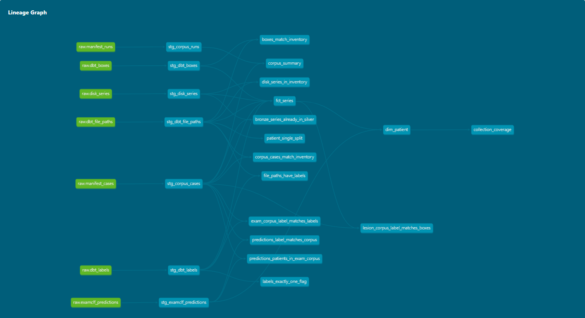

# Documentation du projet

> **Research Use Only — Not for diagnostic use.** Outil de recherche, pas un dispositif
> médical. Aucune décision clinique ne doit en dépendre.

Ce document rassemble tout ce qui ne se lit pas directement dans le code : le contexte,
les données, le fonctionnement du pipeline, le catalogue de métadonnées, la démo, les
décisions d'architecture, le journal daté des mesures (échecs compris) et l'état
d'avancement. La présentation du projet est dans le [README](README.md).

Les renvois du code de la forme « DOCUMENTATION.md §4.2 » désignent les sections
numérotées de la **Partie 4 — Journal des mesures**. Les renvois « ADR 0005 » désignent
les décisions de la section **Décisions d'architecture**.

## Sommaire

1. [Contexte et objectif](#contexte-et-objectif)
2. [Cible chiffrée et voie retenue](#cible-chiffrée-et-voie-retenue-2026-09-12)
3. [Données](#données)
4. [Pipeline : fonctionnement et commandes](#pipeline--fonctionnement-et-commandes)
5. [Catalogue de métadonnées (DuckDB + dbt)](#catalogue-de-métadonnées-duckdb--dbt)
6. [Stockage objet (S3 / MinIO)](#stockage-objet-s3--minio)
7. [Démo et application web](#démo-et-application-web)
8. [Décisions d'architecture (ADR)](#décisions-darchitecture-adr)
9. [Partie 4 — Journal des mesures](#partie-4--journal-des-mesures)
10. [Prochaines pistes pour l'étape 1](#prochaines-pistes-pour-létape-1)
11. [État d'avancement et feuille de route](#état-davancement-et-feuille-de-route)
12. [Écarts doc ↔ code](#écarts-doc--code)
13. [Partie 3 — Charte graphique](#partie-3--charte-graphique)
14. [Développement](#développement)
15. [Licence et données](#licence-et-données)

---

## Contexte et objectif

### La question

Un examen de dépistage mammaire (tomosynthèse DBT ou IRM) en entrée, une réponse en
sortie : **y a-t-il un cancer ?** C'est l'« étape 1 ». Le projet utilise uniquement des
données publiques de [The Cancer Imaging Archive](https://www.cancerimagingarchive.net/)
(TCIA).

### Deux objectifs

1. **Contribuer, à mon niveau, au secteur médical** en construisant l'outil de bout en
   bout, honnêtement mesuré.
2. **Un projet de portfolio de data engineering** (réorientation du 2026-09-16) :
   ingestion de 138 Go de DICOM, stockage en couches, validation, lignage, orchestration,
   catalogue de métadonnées en SQL/dbt, CI, Docker. Depuis cette date, les livrables de
   data engineering passent avant les nouvelles expériences de modélisation.

### Retrait de l'étape 2, focus exclusif sur l'étape 1 (2026-09-14)

Le projet avait une seconde question : « cette lésion biopsiée est-elle bénigne ou
maligne ? ». Elle a été **supprimée du dépôt**, pas seulement dépréciée — l'historique
reste dans git :

| Domaine | Retiré |
|---|---|
| Pipeline tabulaire Wisconsin/Spark | `Main.py`, `AnalyzeData.py`, `train_tabular_model.py`, `tabular_export.py`, `Final_Report.md`, fonctions Spark/PCA de `TransformData.py` |
| Route `/biopsie` | gabarit, section « Step 2 » du serveur, `predict_tabular*` |
| Étape 2 en image | `imaging/lesionclf.py` (§4.5) |
| BreakHis (histopathologie) | `ExtractBreakHis.py` |
| Artefacts | `models/tabular/`, `models/lesionclf/`, graphiques associés |

**Pourquoi.** L'étape 2 avait un modèle servi (Wisconsin tabulaire, ROC-AUC 99,9 %, avec
une fuite de prétraitement connue et jamais corrigée : imputation, standardisation et PCA
ajustées sur les 569 lignes avant le découpage). L'étape 1, elle, venait d'accumuler
trois résultats négatifs d'affilée (`lesionclf` AUC 0,513, `examclf` 0,457, `examclf`
sac de 32 : 0,414). Diviser l'effort entre une étape qui marche et une étape qui échoue
n'avait plus de sens : l'étape 1 est le goulot.

**Ne pas proposer de réintroduire** `/biopsie`, le pipeline Wisconsin, BreakHis ou
`lesionclf` : leur retrait est une décision, pas un oubli.

### Deux modalités, deux rôles

- **DBT / mammographie** (`Breast-Cancer-Screening-DBT`) porte la **détection** (étape 1)
  depuis le 2026-09-12.
- **IRM dynamique DCE-MRI** (`Duke-Breast-Cancer-MRI`) porte la **localisation** d'une
  lésion une fois l'examen jugé suspect. C'est le modèle servi dans la démo.

---

## Cible chiffrée et voie retenue (2026-09-12)

### La cible

Point de fonctionnement visé, **au niveau patient**, pris sur le programme national de
dépistage organisé :

| Mesure | Cible | Source |
|---|---:|---|
| Sensibilité | **82,8 %** | Santé publique France, dépistage organisé 50-74 ans |
| Spécificité | **91,4 %** | idem |
| Sensibilité selon la tranche d'âge | 76 – 88 % | idem |
| Sensibilité à 1 an (cancers d'intervalle inclus) | 94,2 % | idem |

Sous hypothèse binormale, ce couple correspond à une **ROC-AUC patient d'environ 0,95**.
Repères de contexte (pas des cibles) : faux négatifs > 15 % (MSD), 85 à 90 % des
anomalies détectées ne sont pas des cancers (MSD), VPP 11,3 % en 2020 contre 7,8 % en
2008 (SpF).

### Ce qu'on ne vise pas : la VPP

Sensibilité et spécificité sont des propriétés du modèle à un seuil. **La VPP n'en est
pas une** : elle dépend de la prévalence. Au taux de détection du programme (~6,7 cancers
pour 1 000), Se 82,8 % et Sp 91,4 % donnent

    0,0067 × 0,828 / (0,0067 × 0,828 + 0,9933 × 0,086) = 6,1 %

et non 11,3 % : les deux chiffres publiés ne décrivent pas le même point de
fonctionnement. Sur un jeu de test équilibré, le même modèle afficherait ~90 % de VPP,
ce qui ne prouverait rien. **Règle : on fixe (Se, Sp) et on publie la prévalence à côté
de toute VPP.** Une VPP sans sa prévalence est un chiffre sans unité.

### La voie retenue : bascule de l'étape 1 sur DBT

Trois raisons, indépendantes, rendaient la cible inatteignable sur le corpus IRM :

1. **Mauvaise modalité** : les chiffres visés sont ceux de la mammographie de dépistage.
2. **Mauvaise population** : Duke est une cohorte diagnostique, prévalence 100 %, et le
   prétraitement écarte en plus tout patient sans boîte. Une spécificité ne se mesure pas
   sans négatifs.
3. **Le piège de la solution évidente** : cancers de Duke + négatifs d'ailleurs donnent
   un modèle qui apprend le scanner et une AUC de 0,99 qui ne vaut rien. Les deux classes
   doivent venir de la **même collection**.

`Breast-Cancer-Screening-DBT` lève les trois : collection de dépistage, majoritairement
normale. La bascule n'annule pas le travail IRM : le U-Net garde sa fonction de
localisation, il quitte seulement le chemin critique de l'étape 1.

### Ligne de base au 2026-09-12 (avant tout corpus à deux classes)

| Mesure | Cible | Alors |
|---|---:|---|
| Sensibilité patient | 82,8 % | 100 %, trivialement : la sortie était constante |
| Spécificité patient | 91,4 % | 0 %, non mesurable (aucun patient sain) |
| ROC-AUC patient | ≈ 0,95 | non mesurable |
| Spécificité par coupe | — | 0,03 % (99,97 % des coupes saines alarment) |

`inference._localize_lesion` décidait par `best_conf >= 0.5`, et `best_conf` valait
1,0000 partout (28/28 patients test, 160/160 coupes de `Breast_MRI_001`). « Durcir le
seuil » ne suffit pas : décider « au moins une coupe s'allume » sur ~160 coupes à
Sp 91,4 % demanderait 99,94 % de spécificité par coupe. Il faut une **tête de décision au
niveau examen**, pas un meilleur seuil.

### Ce que la cible coûte en données

| Objectif de mesure (jeu de test seul) | ± 5 points | ± 3 points |
|---|---:|---:|
| Sensibilité 82,8 % → patients avec cancer | ~220 | ~610 |
| Spécificité 91,4 % → patients sans cancer | ~121 | ~335 |

**La collection entière ne contient que 89 patients cancer.** La spécificité est donc
mesurable finement (4 581 normaux), la sensibilité non : un test à 20 % laisse ~18
cancers (IC ±17 points) ; même en consacrant les 89 cancers au test, on resterait vers
±8 points. BCS-DBT ne peut pas départager 82,8 % de 76 % ou 94 %. Tout point obtenu doit
être publié avec son IC et **jamais présenté comme une comparaison au programme
national**.

---

## Données

### Collections

| Collection | Contenu | Rôle | Licence |
|---|---|---|---|
| **Breast-Cancer-Screening-DBT** (BCS-DBT) | 5 060 patients, tomosynthèses DICOM + 9 tables d'annotations | détection (étape 1), catalogue | CC BY-NC 4.0 |
| **Duke-Breast-Cancer-MRI** | IRM dynamiques DICOM de patientes avec cancer, boîtes de lésion | localisation (démo) | CC BY-NC 4.0 |

Espace disque mesuré le 2026-09-15 : **138 Go** sous `data/raw_data/tcia/`, dont 82,6 Go
de séries DBT (1 047 séries, mesuré par le catalogue le 2026-09-16).

### Les tables BCS-DBT

Neuf tables, trois par split (train, validation, test), téléchargées par
`ExtractData.download_dbt_tables()` :

| Table | Contenu | Lignes (3 splits) |
|---|---|---:|
| `BCS-DBT-labels-*.csv` | statut par vue : Normal / Actionable / Benign / Cancer — **seule source du mot « normal »** | 22 032 |
| `BCS-DBT-file-paths-*.csv` | inventaire : (PatientID, StudyUID, View) et chemin de chaque série | 22 032 |
| `BCS-DBT-boxes-*.csv` | une boîte par lésion annotée : coupe, x/y/largeur/hauteur, `Class` (benign/cancer), `AD` | 435 (224 + 75 + 136) |

Statut patient, lu **à sa pire vue** (cancer > benign > actionable > normal) :

| Collection entière | Patients |
|---|---:|
| normal | **4 581** |
| actionable | 278 |
| benign | 112 |
| cancer | **89** |
| **Total** | **5 060** |

Ces chiffres sont reproduits indépendamment par le code Python
(`TransformData.dbt_patient_status`) et par le catalogue SQL.

Deux pièges propres à ces données :
- **le tag DICOM de latéralité est faux** : il lit `L` sur toutes les séries (§4.4) ;
- **les DICOM ne portent aucun tag d'espacement de pixel** : une fenêtre constante en
  pixels ne vaut fenêtre constante en millimètres que parce que la géométrie du détecteur
  est constante (2 457 lignes partout).

### Stockage en couches

```
data/
├── raw_data/          exactement ce que la source publie, jamais réécrit
│   └── tcia/          séries DICOM + tables d'annotations (138 Go)
├── preprocessed_data/ volumes z-normalisés + masques, un .npz par série
│   ├── dbt/           preprocess_dbt_with_boxes : examens annotés, recadrés sur la lésion
│   ├── dbt_exams/     preprocess_dbt_exams : tous les examens en 384×384, cancer ou non
│   └── dce_mri_p2/    preprocess_dce_mri_with_boxes (le modèle de la démo)
│                      preprocess_dce_mri_exams pour un examen jamais annoté
└── curated_data/      dérivé et reconstructible : banques de coupes, cas de démo, catalogue
models/                checkpoints + les métriques qui les justifient
reports/               rapports JSON
docs/img/              images de la documentation
```

Chaque chemin est défini **une seule fois** dans `config.py`. `data/` est ignoré par git,
sauf les trois cas de démo ; `models/` l'est aussi, sauf les deux checkpoints de la démo
et les rapports de validation croisée.

---

## Pipeline : fonctionnement et commandes

### Vue d'ensemble

| Étape | Où | Ce qu'elle garantit |
|---|---|---|
| **Extraction** | `ExtractData.py`, `http_timeouts.py` | Téléchargements qui reprennent là où ils s'arrêtent ; plafond exprimé en volume ajouté par l'appel ; examens normaux tirés avec une graine (les ID suivent le site et la date) ; délai maximal sur chaque requête ; une série n'est comptée que si son dossier existe. |
| **Orchestration** | `pipelines/dbt.py`, `pipelines/dce_mri.py` | Deux flows Prefect ; chaque étape de la chaîne DBT décide depuis un plan calculé hors ligne (ADR 0011). |
| **Stockage** | `config.py` | Trois couches `raw_data` → `preprocessed_data` → `curated_data`, chemins définis une fois. |
| **Transformation** | `TransformData.py` | Annotations rattachées par **jointure**, jamais inférées ; étiquette tirée de la seule table qui dit « normal » ; même géométrie pour les deux classes. |
| **Validation** | `validation.py` | Dimensions, type, valeurs finies et masque binaire vérifiés au point unique d'écriture. |
| **Lignage** | `lineage.py` | Un `manifest.json` par dossier : révision git (suffixe `-dirty`), source, paramètres, statistiques par cas. Écrit en dernier : son absence signale une passe interrompue. |
| **Curation** | `imaging/exambank.py`, `imaging/slicebank.py` | Banques memmap qui paient la décompression une seule fois (×7,1 sur le temps d'époque). |
| **Catalogue** | `catalog/` | Tables, disque, manifestes et scores joints dans DuckDB ; couches et tests dbt. |
| **Publication** | `objectstore/` | Tables, manifestes et tables mart en Parquet synchronisés vers un bucket S3 (MinIO en local) ; idempotent, sans suppression. |
| **Entraînement / évaluation** | `imaging/` | Découpages par patient, validation croisée, IC bootstrap par patient, seuil hors pli. |
| **Service** | `app/`, `Dockerfile` | Flask HTML + API JSON ; image sans JVM ni ITK, lecture seule, non-root, boucle locale uniquement. |

### Prérequis et installation

- Python ≥ 3.12 ; `torch` adapté à la machine (CPU : `--index-url https://download.pytorch.org/whl/cpu`).
- Accès TCIA via `tcia_utils` / `nbia` : les collections publiques ne demandent pas de clé.

```bash
pip install -r requirements.txt       # installe le projet (pyproject.toml)
pip install -e ".[dev]"               # + pytest, ruff
pip install -e ".[orchestration]"     # + Prefect, pour pipelines/
pip install -e ".[catalog]"           # + dbt-duckdb, pour construire le catalogue
pip install -e ".[storage]"           # + boto3, pour publier vers un stockage objet S3
```

### Pipeline DCE-MRI orchestré (Prefect)

Les quatre étapes — téléchargement, prétraitement, entraînement, évaluation — forment un
flow Prefect dans `pipelines/dce_mri.py` :

```bash
python -m pipelines.dce_mri --dry-run          # affiche le plan, n'exécute rien
python -m pipelines.dce_mri                    # exécute
python -m pipelines.dce_mri --from preprocess  # reprend en sautant le téléchargement de 60 Go
```

Chaque étape vérifie sa propre sortie et saute ce qui est déjà fait (`--force` pour
refaire). **Seul le téléchargement réessaie** : un échec TCIA est transitoire, un
entraînement qui plante replanterait au même endroit une heure plus tard. Les tâches
appellent les mêmes fonctions que les commandes manuelles, qui ne peuvent donc pas
diverger.

### Préparer une IRM jamais annotée (2026-09-19)

Le flow ci-dessus prépare le corpus **annoté** : `preprocess_dce_mri_with_boxes`
ignore tout patient absent de la table d'annotations. Un examen nouveau est exactement
ce patient-là — il n'y avait donc aucun chemin du DICOM jusqu'à un volume que l'app
accepte. `preprocess_dce_mri_exams` le fournit :

```python
from TransformData import preprocess_dce_mri_exams

# root_dir contient les dossiers de séries du patient (un par SeriesInstanceUID).
preprocess_dce_mri_exams("data/raw_data/nouveaux_examens",
                         output_dir="data/preprocessed_data/nouveaux_examens")
```

Il ne demande que ce qu'exige une soustraction : la série pré-contraste et la passe
post-contraste choisie (la 2ᵉ par défaut, §4.1). Le masque est vide et **la trame
n'est jamais recadrée** — les deux découlent de l'absence d'annotation : il n'y a
aucune lésion sur laquelle recadrer, et la pleine trame est la géométrie sur laquelle
le checkpoint servi a été entraîné.

**Ce qui garantit que le volume est le bon.** Les deux chemins appellent la même
fonction `dce_subtraction` — une seule définition de « post − pré, seuillé à 0, puis
z-normalisé ». L'égalité est donc structurelle, pas seulement testée ; un test la
vérifie quand même, et une mutation prouve qu'il sait échouer (§4.16).

Un examen incomplet (pré ou post manquante, passe demandée absente, formes
discordantes entre phases) est compté et sauté, sans interrompre les autres.

### Chaîne DBT orchestrée (Prefect)

`pipelines/dbt.py` enchaîne `tables → download → preprocess → catalog → publish` :

```bash
python -m pipelines.dbt --dry-run            # le plan, calculé hors ligne, rien n'est exécuté
python -m pipelines.dbt                      # exécute ce qui manque
python -m pipelines.dbt --from preprocess    # sans les étapes réseau
```

**Chaque étape décide depuis un plan, pas depuis « le dossier existe »** (ADR 0011). La
couche brute grossit dans le temps, et un corpus construit avant un téléchargement est
un dossier qui existe et qui est périmé. Chaque étape calcule donc hors ligne, à partir
des tables de la collection, ce qui devrait exister, le compare à ce qui existe et ne
s'exécute que s'il manque quelque chose :

| Étape | Plan | Exécution |
|---|---|---|
| `tables` | les 9 tables présentes ? | téléchargement, 3 reprises |
| `download` | séries des patients annotés (splits choisis) + échantillon de normaux (graine), lues dans l'inventaire, contre les dossiers sur disque | seuls les patients incomplets, 2 reprises ; une série ratée lève `DownloadIncomplete` |
| `preprocess` | séries que chaque corpus devrait contenir d'après le disque, contre les cas de son manifeste | corpus d'examens repris (seules les séries manquantes sont décodées) ; corpus de lésions reconstruit |
| `catalog` | toujours | build DuckDB + dbt ; un test dbt `error` en échec fait échouer le flow |
| `publish` | `BREASTCANCER_S3_ENDPOINT` défini ? | synchronisation idempotente vers le bucket, 2 reprises ; sautée sinon |

Options : `--annotated-splits` (défaut : les trois), `--corpus-splits` (défaut :
`train,validation`, les corpus de toutes les mesures publiées), `--max-normal-patients`
(150), `--max-gb-added` (50), `--seed` (0), `--force`.

**Plan réel au 2026-09-16** (`--dry-run`, 10 s, aucun accès réseau) :

```
  tables      9/9 present -> skip
  download    201 annotated (train,validation,test) + 150 normal patients -> 1060 series planned, 1047 series on disk
              -> 15 missing across 9 patient(s): DBT-P03621, DBT-P03628, DBT-P03689, DBT-P03728, DBT-P04097, DBT-P04346...
  preprocess  lesion corpus (train,validation): 260 expected, 260 in manifest -> skip
  preprocess  exam corpus (train,validation): 870 expected, 870 in manifest -> skip
  catalog     always rebuilt -> data\curated_data\catalog\catalog.duckdb
```

Le plan recoupe le catalogue sans le lire : les 15 séries manquantes sont celles des 9
patients annotés jamais téléchargés, et le nombre de séries attendues par corpus,
recalculé depuis les tables et le disque, retombe exactement sur le contenu des
manifestes. Exécution réelle `--from preprocess` : deux corpus jugés à jour, catalogue
reconstruit, 36/36 tests dbt, flow `Completed` en 60 s (démarrage du serveur Prefect
temporaire compris).

**Robustesse des téléchargements.** `tcia_utils` 3.3.4 envoie ses requêtes sans délai
maximal et avale toutes les exceptions. Deux corrections :
- `http_timeouts.install(nbia)` ajoute un délai de 30 s à la connexion et de 600 s
  d'inactivité en lecture à chaque `get`/`post` du client. Un `socket.setdefaulttimeout`
  ne suffit pas : mesuré, une requête vers un serveur muet restait bloquée après 8 s,
  alors qu'un `timeout=` explicite lève `ReadTimeout` en 2 s. Le délai de lecture est
  calibré sur le journal réel (122 séries : médiane 13 s, p90 49 s, pire cas 565 s) ;
- une série n'est comptée téléchargée que si son dossier existe après l'appel ; avec
  `raise_on_failure`, le téléchargement termine ce qu'il peut puis lève
  `DownloadIncomplete`, ce qui déclenche la reprise Prefect.

### Chaîne DBT (commandes manuelles)

```python
import config
from ExtractData import download_annotated_dbt_series, download_dbt_tables, download_normal_dbt_series
from TransformData import preprocess_dbt_exams, preprocess_dbt_with_boxes

download_dbt_tables()                                   # les 9 tables, une fois

BOXES = [config.DBT_BOXES_TRAIN, config.DBT_BOXES_VALIDATION]
download_annotated_dbt_series(BOXES, max_patients=None, max_gb=25)
download_normal_dbt_series(max_patients=150, max_gb_added=50)  # ~310 Mo par patient

preprocess_dbt_with_boxes(boxes_csv=BOXES, file_paths_csv=config.DBT_FILE_PATHS,
                          output_dir="data/preprocessed_data/dbt")   # corpus « lésions »
preprocess_dbt_exams(boxes_csv=BOXES)                                 # corpus « examens »
```

**Corpus « lésions » (`preprocess_dbt_with_boxes`).** Chaque série est rattachée à ses
boîtes par une jointure sur `(PatientID, StudyUID, View)` via l'inventaire `file-paths`
(ADR 0004). Un dossier absent de l'inventaire est ignoré et compté. Les pixels ne servent
qu'à détecter une étude stockée en miroir, qui est retournée ; le manifeste le trace. La
colonne `Class` est **lue et exigée** : chaque `.npz` porte `lesion_class`
(`benign`/`cancer`) et `label` 0/1, car le masque ne peut pas porter la classe — une
lésion bénigne peint les mêmes pixels qu'un cancer. `mask_classes=("cancer",)` ne peint
que les cancers ; par défaut les deux sont peints. Résultat : **260 séries, 132 patients
(76 bénins, 56 cancers), 0 masque vide, 0 avertissement, 1,00 Go, 56 min**.

**Corpus « examens » (`preprocess_dbt_exams`).** Le corpus sur lequel une décision
d'examen se mesure. L'étiquette vient des tables `labels`, lue à la pire vue ; une série
sans ligne de labels est ignorée et comptée, jamais supposée normale. `label` vaut 1
uniquement pour `cancer` (`actionable` et `benign` valent 0) et le mot est gardé dans
`exam_status`. **Une seule géométrie pour les deux classes** (ADR 0005) : trame entière
ramenée à 384×384 en gardant les proportions, complétée par des zéros, toutes les coupes
conservées, aucun recadrage ; le sous-échantillonnage moyenne au lieu d'échantillonner ;
le même retournement s'applique aux négatifs. Mesuré : 4,9 Mo par série compressée,
~14 s de décodage chacune, reprise possible (`skip_existing=True`) : une passe reprise
conserve dans le manifeste les cas qu'elle saute, et un volume sans entrée de manifeste
(passe interrompue) est reconstruit (§4.14). Résultat : **870 examens, 272 patients, 56
cancers**.

### Entraînement et évaluation

| Commande | Rôle |
|---|---|
| `python -m imaging.train --data-dir <dir> --epochs 25` | U-Net 2D de localisation (BCE + soft-Dice), découpage par patient, meilleur checkpoint + `segmentation_metrics.csv`. `--smoke-test` valide la boucle sans données. |
| `python -m imaging.evaluate --data-dir data/preprocessed_data/dce_mri_p2 --checkpoint models/dce_mri_p2_negfix/unet_best.pt` | IC bootstrap par patient, sensibilité lésion, faux positifs par volume, temps d'inférence → `eval_report.json` + `eval_per_patient.csv`. |
| `python -m imaging.sliceclf --slice-bank data/curated_data/slice_bank_p2 --epochs 25` | Classifieur de coupe, sélectionné sur le top-1 (§4.3). |
| `python -m imaging.examclf --data-dir data/preprocessed_data/dbt_exams --folds 5` | Tête de décision au niveau examen (MIL), validation croisée 5 plis par patient → `cv_report.json` + `cv_predictions.csv` (§4.7). |
| `python -m imaging.oppoint` | Point de fonctionnement depuis les prédictions hors pli, sans réentraîner → `reports/examclf_operating_point.json`, et affiche la section reprise au §4.11. |

---

## Catalogue de métadonnées (DuckDB + dbt)

Un fichier DuckDB unique qui rassemble tout ce qui décrit les données DBT : les 9 tables
d'annotations, les séries présentes sur disque, le contenu de chaque corpus et le score
de chaque patient. Il s'interroge en SQL ; ses transformations sont un **projet dbt** et
chaque build exécute **36 tests dbt**.

```bash
pip install -e ".[catalog]"
python -m catalog build            # ~10 s sur la collection complète
python -m catalog checks --all     # rapport qualité du dernier build
python -m catalog tables
python -m catalog query "SELECT status, count(*) FROM mart.dim_patient GROUP BY ALL"
python -m catalog query --file catalog/queries/01_data_funnel.sql
python -m catalog docs             # site de documentation dbt, graphe de lignage compris
```

Sortie : `data/curated_data/catalog/catalog.duckdb` (7,6 Mo), les tables `mart` en
Parquet sous `parquet/`, les artefacts dbt sous `dbt_target/`. Tout est dérivé : le
supprimer ne perd rien.

**Pourquoi il existe.** Avant lui, « combien de cancers du split validation sont
téléchargés, et sont-ils tous dans le corpus d'examens ? » demandait de charger trois CSV,
deux manifestes et un listing de dossier dans pandas, et de réécrire la jointure. Chaque
réponse était un script jetable, jamais testé.

### Déroulé d'un build

| Étape | Outil | Ce qui se passe |
|---|---|---|
| 1. Charger `raw` | Python (`catalog/build.py`) | Ce que dbt ne sait pas faire : réunir des CSV aux schémas différents (`union_by_name`), lister le disque par `stat`, aplatir les manifestes JSON |
| 2. `dbt run` | dbt (`catalog/dbt/`) | Construit les vues `stg` et les tables `mart` |
| 3. `dbt test` | dbt | 25 tests génériques + 11 tests singuliers ; les lignes fautives de chaque test restent dans `qa` |
| 4. Enregistrer et exporter | Python | `qa.check_results`, `main.build_info`, export Parquet, remplacement atomique du fichier |

`dbt run` et `dbt test` sont séparés à dessein : `dbt build` sauterait les modèles
en aval d'un test en échec et cacherait les tables nécessaires à l'enquête. Un test en
échec de sévérité `error` rend un code de sortie non nul, mais le catalogue est quand
même écrit (`SELECT * FROM qa.<nom du test>`).

Le build écrit dans un dossier temporaire, **sous le nom de fichier définitif**, puis
remplace le fichier seulement quand tout a réussi : un build raté laisse l'ancien
catalogue intact. Le nom compte : dbt-duckdb inscrit le nom de la base (tiré du nom de
fichier) dans chaque vue, et un build dans `tmpXXXX.duckdb` renommé ensuite cassait
toutes les vues `stg` (§4.13).

### Couches



*Graphe de lignage dbt (`python -m catalog docs`, capturé par
`scripts/make_dbt_lineage_png.py`). En vert, les sources `raw` ; en bleu, les modèles et
les tests singuliers. Les 25 tests génériques, déclarés en YAML, ne sont pas dessinés.*

| Couche | Contenu | Défini dans |
|---|---|---|
| `raw` | Sources telles que publiées, plus le fichier d'origine de chaque ligne (7 tables) | `catalog/build.py`, déclarées comme sources dans `_sources.yml` |
| `stg` | 7 vues, une par source : clés nettoyées, vues en minuscules, split tiré du nom de fichier, statut de pire drapeau | `catalog/dbt/models/staging/` |
| `mart` | 4 tables à granularité déclarée et testée | `catalog/dbt/models/marts/` |
| `qa` | Lignes fautives de chaque test + `check_results` | `catalog/dbt/tests/` et YAML des modèles |

Une macro garde les noms de schéma tels quels (`stg`, `mart`, `qa` au lieu de `main_stg`)
et les modèles de staging sont aliasés (`stg_dbt_labels` exposé en `stg.dbt_labels`).

### Tables `mart`

| Table | Granularité | Colonnes principales |
|---|---|---|
| `mart.fct_series` | une série de la collection (22 032) | `series_uid`, `patient_id`, `split`, `view_status`, `n_boxes`, `n_cancer_boxes`, `on_disk`, `disk_bytes`, `in_lesion_corpus`, `in_exam_corpus`, `exam_label`, `n_slices`, `mirrored` |
| `mart.dim_patient` | un patient (5 060) | `status` (pire vue), `split`, `n_series`, `n_boxes`, `n_series_on_disk`, `fully_on_disk`, `disk_gb`, `n_series_in_exam_corpus`, `examclf_score`, `examclf_fold` |
| `mart.collection_coverage` | split × statut | patients publiés, sur disque, dans le corpus d'examens, notés |
| `mart.corpus_summary` | corpus prétraité | séries, patients, patients positifs, profondeur moyenne, miroirs, révision git de la passe |

### Tests de qualité

**25 tests génériques** (tous `error`) : `unique` + `not_null` sur les granularités
(`fct_series.series_uid`, `dim_patient.patient_id`, `stg_dbt_file_paths.series_uid`,
clé patient/étude/vue des labels, corpus/série des cas…), `accepted_values` (split,
statut, latéralité, incidence, classe de lésion, corpus, étiquette d'examen),
`relationships` (`fct_series.patient_id` → `dim_patient`).

**11 tests singuliers** (règles métier) :

| Test | Sévérité | Protège contre |
|---|---|---|
| `boxes_match_inventory` | error | une boîte qui n'appartient à aucune série (ADR 0004) |
| `patient_single_split` | error | un patient dans deux splits, donc une fuite train/test |
| `corpus_cases_match_inventory` | error | un volume rattaché au mauvais patient, étude ou vue |
| `exam_corpus_label_matches_labels` | error | une étiquette d'examen en désaccord avec la table labels |
| `lesion_corpus_label_matches_boxes` | error | une étiquette de lésion en désaccord avec la classe de la boîte |
| `predictions_patients_in_exam_corpus` | error | un score pour un patient que le classifieur n'a jamais vu |
| `predictions_label_matches_corpus` | error | une étiquette de score différente de celle du corpus |
| `labels_exactly_one_flag` | warn | une ligne de labels avec zéro ou plusieurs drapeaux |
| `file_paths_have_labels` | warn | une série sans ligne de labels (ignorée au prétraitement) |
| `corpus_series_on_disk` | warn | un cas prétraité dont la série brute a disparu |
| `disk_series_in_inventory` | warn | un dossier téléchargé que l'inventaire ne liste pas |

**Sur les données réelles, les 36 passent.** Des tests qui passent tous pourraient ne
jamais savoir échouer : `tests/test_catalog.py` exécute le vrai projet dbt sur une
collection miniature et y injecte six défauts (étiquette d'examen fausse, étiquette de
lésion fausse, cas sur le mauvais patient, score hors corpus, étiquette de score fausse,
clé de labels dupliquée), en vérifiant à chaque fois que le bon test échoue ; une série
brute supprimée ne doit lever qu'un avertissement.

### Requêtes d'exemple et résultats (build du 2026-09-16)

Rangées dans `catalog/queries/` et exécutées par la suite de tests.

**1. Entonnoir des données** (`01_data_funnel.sql`, extrait) :

| split | statut | patients | sur disque | corpus d'examens | notés | Go |
|---|---|---:|---:|---:|---:|---:|
| train | cancer | 39 | 39 | 39 | 39 | 6,3 |
| train | benign | 62 | 62 | 62 | 62 | 10,5 |
| train | normal | 4 083 | 135 | 135 | 135 | 44,7 |
| validation | cancer | 20 | **17** | 17 | 17 | 2,6 |
| validation | benign | 20 | **14** | 14 | 14 | 2,9 |
| validation | normal | 200 | 5 | 5 | 5 | 1,5 |
| test | cancer | 30 | 30 | **0** | 0 | 5,3 |
| test | benign | 30 | 30 | **0** | 0 | 4,5 |

**2. Patients annotés jamais téléchargés** (`02_…sql`) : 9 patients, tous du split
validation, **dont 3 cancers** (DBT-P03621, DBT-P03628, DBT-P04596) — l'écart jusque-là
inexpliqué entre les 89 cancers publiés et les 86 sur disque. Coût estimé : ~0,5 Go
(6 séries à la moyenne de 85 Mo des séries cancer présentes).

**3. Score du classifieur par statut réel** (`03_…sql`) :

| statut | patients | score moyen | médiane |
|---|---:|---:|---:|
| normal | 140 | 0,187 | 0,182 |
| cancer | 56 | 0,181 | 0,168 |
| benign | 76 | 0,180 | 0,161 |

Les normaux ont un score moyen **plus élevé** que les cancers : l'AUC de 0,457 (§4.11)
lisible dans un `GROUP BY`.

**4. Équilibre du corpus d'examens par vue et par côté** (`04_…sql`) : prévalence cancer
de 9,9 % (MLO gauche) à 14,4 % (MLO droite) ; les 48 séries en miroir sont **toutes des
vues gauches**, conséquence attendue de la règle de retournement, à savoir avant
d'utiliser `mirrored` comme variable.

**Autres constats** : les 60 patients annotés du split test sont sur disque mais dans
aucun corpus (téléchargés le 2026-09-14, après la construction du corpus d'examens) ;
152 patients normaux sont sur disque alors que 150 avaient été tirés (non investigué).

**Limites** : DBT seulement (le corpus DCE-MRI n'a pas de manifeste) ; la présence sur
disque vient de `stat`, pas d'une lecture du DICOM ; build complet en 9,7 s contre 3,9 s
avant dbt (démarrage et parsing de dbt), sans modèle incrémental.

---

## Stockage objet (S3 / MinIO)

La couche de données se publie vers n'importe quel stockage compatible S3 : **MinIO** en
local, **AWS S3** (ou équivalent) dans le cloud. Le code ne parle que l'API S3 standard
(boto3).

```bash
pip install -e ".[storage]"
docker compose --profile storage up -d minio        # MinIO local (Docker requis)
export BREASTCANCER_S3_ENDPOINT=http://127.0.0.1:9000
export AWS_ACCESS_KEY_ID=minioadmin AWS_SECRET_ACCESS_KEY=minioadmin

python -m objectstore plan                   # ce qu'une synchronisation enverrait, rien n'est envoyé
python -m objectstore sync                   # tables, manifestes, catalogue en Parquet
python -m objectstore sync --dicom-sample 5  # + les DICOM bruts de 5 séries, pour la démonstration
python -m objectstore ls --prefix curated/
python -m pipelines.dbt --from publish       # la même chose, comme étape du flow
```

Le bucket (`BREASTCANCER_S3_BUCKET`, défaut `breastcancer`) et le point d'accès viennent de
l'environnement ; les identifiants viennent des variables AWS standard, jamais du code.
Les identifiants par défaut de `docker-compose.yml` ne valent que pour une instance locale,
publiée sur la boucle locale uniquement.

### Ce qui est publié, et où

Les clés reprennent les couches locales : un chemin dans le bucket dit à quelle couche il
appartient.

| Clé | Contenu | Taille |
|---|---|---:|
| `raw/tcia/tables/BCS-DBT-*.csv` | les 9 tables d'annotations | 8,1 Mo |
| `preprocessed/<corpus>/manifest.json` | le manifeste de lignage de chaque corpus | 0,5 Mo |
| `curated/catalog/<table>.parquet` | les 4 tables `mart` du catalogue | 0,9 Mo |
| `raw/tcia/series/<SeriesInstanceUID>/…` | DICOM bruts, **uniquement sur demande** (`--dicom-sample`) | ~70 Mo par série |
| `_meta/last_sync.json` | trace de la dernière synchronisation : date, révision git, décompte, clés | — |

**Par défaut, les 83 Go de DICOM restent sur disque** : on publie ce qui est léger et utile
à partager. La synchronisation sait envoyer les DICOM (envoi en plusieurs parties au-delà
de 64 Mo) et le fait pour un échantillon quand on le demande.

### Garanties

- **Idempotente** : un objet dont la taille et l'empreinte MD5 correspondent au fichier
  local est ignoré ; un objet différent est renvoyé. Pour les fichiers envoyés en plusieurs
  parties, l'ETag S3 n'est plus un MD5 : l'empreinte est donc aussi stockée en métadonnée,
  et c'est elle qui est comparée.
- **Sans suppression** : un objet présent seulement dans le bucket est signalé, jamais
  supprimé — la couche brute n'est jamais réécrite, et une étape de publication n'a pas à
  détruire ce que quelqu'un d'autre y a déposé.
- **Planifiable** : `plan` compare sans rien envoyer et sans créer le bucket.

### Interroger le bucket directement

Les tables `mart` publiées en Parquet se lisent **sans rien télécharger au préalable**,
par exemple avec DuckDB et son extension `httpfs` :

```sql
INSTALL httpfs; LOAD httpfs;
CREATE SECRET (TYPE S3, KEY_ID '…', SECRET '…', ENDPOINT '127.0.0.1:9000',
               URL_STYLE 'path', USE_SSL false);
SELECT status, count(*) FROM 's3://breastcancer/curated/catalog/dim_patient.parquet' GROUP BY ALL;
SELECT count(*) FROM read_csv('s3://breastcancer/raw/tcia/tables/BCS-DBT-labels-*.csv');
```

### Vérification

Docker n'étant pas disponible sur la machine de développement, **MinIO lui-même n'a pas été
exécuté**. Le code a été vérifié de deux façons (§4.15) :
- **tests automatiques** contre un S3 simulé en mémoire (moto) : idempotence, fichier
  modifié renvoyé, contenu différent à taille égale détecté, comparaison MD5 des envois en
  plusieurs parties, objets distants conservés, plan sans écriture, trace de
  synchronisation ;
- **vérification réelle** contre un point d'accès S3 HTTP local (serveur moto), avec les
  vraies données, puis lecture du Parquet et des CSV directement depuis le bucket par
  DuckDB.

---

## Démo et application web

### Lancer la démo

```bash
git clone https://github.com/Elias-Ouafi/breastcancer && cd breastcancer
pip install -r requirements.txt
python run_demo.py              # puis ouvrir http://127.0.0.1:5000
docker compose up --build       # alternative avec Docker seul
```

Rien d'autre à télécharger : le modèle (`models/dce_mri_p2_negfix/unet_best.pt`) et les
trois cas de démo sont versionnés. Le serveur écoute uniquement sur `127.0.0.1`.

**La veille**, `python run_demo.py --check` vérifie les prérequis sans occuper de port.

### Déroulé conseillé

1. Cliquer sur **Cas 1** (pas de sélecteur de fichier à manipuler en direct).
2. Dérouler le résultat : verdict et temps de calcul (~70 ms à chaud, ~0,6 s au premier
   appel), coupe annotée avec le cadre sur la zone de rehaussement, **curseur** entre les
   coupes (la lésion apparaît, culmine, disparaît), **Vue MIP** (projection d'intensité
   maximale), *Détail technique* dépliable.
3. Enchaîner sur **Comment ça marche** si l'interlocuteur veut le pipeline.

Le cadre n'est tracé que sur la coupe réellement évaluée ; les voisines sont affichées
telles quelles.

### Les trois cas

| Fichier | Patient | Coupe | IoU vérifié | Cadre |
|---|---|:---:|:---:|---|
| `demo_1_Breast_MRI_135.npz` | Breast_MRI_135 | 52 sur 176 | 0,830 | 39×42 px |
| `demo_2_Breast_MRI_105.npz` | Breast_MRI_105 | 62 sur 156 | 0,738 | 42×44 px |
| `demo_3_Breast_MRI_079.npz` | Breast_MRI_079 | 104 sur 154 | 0,728 | 66×92 px |

Chaque fichier contient un pavé de **25 coupes** centré sur la coupe indiquée (~4,5 Mo au
lieu de 30 Mo) : le modèle n'en évalue qu'une, les autres servent au curseur et au MIP.
Régénération : `python scripts/make_demo_cases.py` (volumes complets requis). Le GIF du
README : `python scripts/make_demo_gif.py` (Playwright requis, hors dépendances du
projet).

### À dire pendant la démo

> « La coupe a été choisie à l'avance par un humain. Le modèle segmente bien une lésion
> **quand on lui montre la bonne coupe** — 88 % de sensibilité. Il ne sait pas encore la
> trouver seul : un classifieur dédié fait passer ce taux de 0 % à 43 %. »

> « Le Dice de 0,53 n'est pas comparable au ~0,80 de la littérature : nos masques
> d'entraînement sont des boîtes englobantes, pas des contours d'expert. »

> « Rien n'est validé cliniquement. C'est de la recherche sur 186 patients. »

L'app le dit elle-même dans son encart « Limites connues » ; le dire avant qu'on le lise
renforce la crédibilité.

### Chiffres à citer (28 patients de test, `eval_report.json`)

| Mesure | Valeur | IC 95 % |
|---|:---:|:---:|
| Dice (coupes avec lésion) | 0,533 | 0,473 – 0,593 |
| Sensibilité, lésion trouvée (IoU ≥ 0,1) | 88,0 % | 81,9 – 93,4 % |
| Sensibilité, centre visé juste | 81,1 % | 74,0 – 87,7 % |
| Faux positifs par volume | 222 | 205 – 237 |
| Coupes saines déclenchant une alarme | 99,97 % | 99,92 – 100 % |
| Temps de calcul par volume (RTX 5060) | 0,82 s | — |

### Si ça ne marche pas

| Symptôme | Correctif |
|---|---|
| `run_demo.py` refuse de démarrer | Il nomme le prérequis manquant ; suivre la ligne `->` affichée |
| Port déjà utilisé | `python run_demo.py --port 5001` |
| Moteur affiché = `mock` | Le lanceur a été contourné : relancer via `run_demo.py` |
| Aucune coupe annotée | Le fichier n'est pas un `.npz` prétraité : utiliser un cas de `data/curated_data/demo_cases/` |

**Filet de sécurité** : garder une capture d'écran d'un résultat réussi.

### L'application web (`app/`)

Une petite app Flask : on envoie une IRM DCE prétraitée, elle renvoie le verdict, la
coupe et le cadre. Le `.npz` envoyé vient de `preprocess_dce_mri_exams` pour un
examen neuf, ou de `preprocess_dce_mri_with_boxes` pour un examen de la collection
annotée — les deux écrivent le même volume, et un test l'épingle (§4.16). Elle parle uniquement à un `Predictor` (`app/predictor.py`) :

| Backend | Sélection | Rôle |
|---|---|---|
| `mock` (défaut) | — | Fabrique un résultat plausible, ignore les pixels |
| `dce_mri` | `MRI_APP_BACKEND=dce_mri` (posé par `run_demo.py`) | Localisation DCE-MRI via `inference.predict_dce_mri`, sur le volume de soustraction post − pré |

Un troisième backend `unet` (DBT) a été **supprimé le 2026-09-15** : son checkpoint avait
été écrasé par un smoke test (§4.1) et jamais reconstruit.

**Points d'entrée** : `GET /` (formulaire + boutons des cas de démo),
`GET /comment-ca-marche`, `POST /predict` (page HTML, champ `mri`), `POST /demo/<n>`,
`POST /api/predict` (JSON). Contrat de résultat : `lesion_detected`,
`slice_preselected`, `confidence`, `best_slice`, `box_xywh`, `n_slices`.

**Local par conception** : liaison sur `127.0.0.1` uniquement (seul le port est
configurable, `MRI_APP_PORT`), fichiers envoyés supprimés juste après le calcul, toutes
les coupes embarquées en data URI (curseur et MIP sans aller-retour serveur).

**Limite connue** : la sélection automatique de coupe sur un volume complet ne trouve pas
la lésion de façon fiable (0/186 par la confiance de segmentation, 43 % avec le
classifieur de coupe). Les cas de démo imposent une coupe vérifiée via la clé
`forced_slice`, et le résultat le dit (`slice_preselected: true`). `confidence` est un
maximum de probabilité **par pixel**, saturé à 1,0 avec ce checkpoint : l'app l'affiche
sous ce nom, pas comme une confiance d'examen. Le bandeau *Research Use Only* n'est
jamais repliable.

---

## Décisions d'architecture (ADR)

Chaque décision : le contexte qui l'a imposée, ce qui a été décidé, ce qu'elle coûte.

### ADR 0001 — Stockage en couches, chaque chemin défini une fois (en vigueur au 2026-08-18)

**Contexte** : un même nom de dossier était écrit dans une douzaine de fichiers, et les
noms décrivaient des expériences (`results_mri_p2`). **Décision** : trois couches sous
`data/`, artefacts dans un arbre séparé, chemins absolus définis une fois dans
`config.py`. **Coût** : aucun ; exception connue, `models/dce_mri_p2_negfix/` nomme
encore une expérience (le renommer casserait des chemins versionnés de la démo).

### ADR 0002 — Valider au point unique d'écriture, tracer le lignage à côté des données (2026-08-18)

**Contexte** : `crop=True` recentrait chaque volume sur sa lésion et rendait la tâche
triviale (confiance 1,0000 sur 9 patients sur 9, §4.2) ; un dossier de `.npz` ne dit pas
d'où il vient. **Décision** : `validation.py` vérifie chaque volume là où il est écrit,
avec des seuils calibrés sur les données (la fraction de lésion ne sépare rien, de 3,3 %
à 50,9 % sur des volumes légitimes ; la taille dans le plan sépare tout : 448–512 px
contre ~45–72 px, seuil à 128) ; `lineage.py` écrit un manifeste en dernier.
**Coût** : volontairement pas un *système* de lignage (ni serveur, ni base, ni
identifiant de run). Manque : `dce_mri_p2/` n'a pas de manifeste.

### ADR 0003 — Orchestration Prefect, étapes idempotentes, reprise seulement sur échec transitoire (en vigueur au 2026-08-18)

**Contexte** : téléchargement de plusieurs heures, prétraitement CPU, entraînement GPU ;
un script qui meurt à l'étape 3 perd les étapes 1 et 2. **Décision** : flow Prefect,
chaque étape vérifie sa sortie, `--from`/`--force`/`--dry-run`, seul le téléchargement
réessaie. **Coût** : Prefect en dépendance optionnelle, testé en CI dans un job à part. Manques
comblés le 2026-09-16 : la chaîne DBT est un flow (ADR 0011), et les requêtes TCIA ont un
délai maximal — le blocage silencieux de 2 h 30 du 2026-09-14 serait coupé à 10 min et
repris.

### ADR 0004 — Rattacher les annotations par jointure, jamais par inférence (2026-09-13)

**Contexte** : le tag DICOM de latéralité lisait `L` sur les 262 séries (147 séries
appariées sur 253, 23 masques sur du fond) ; l'inférence par les pixels était juste
237 fois sur 262 et prenait 4 fois la boîte de l'autre acquisition d'une vue répétée.
**Décision** : jointure sur `(PatientID, StudyUID, View)` via l'inventaire
`file-paths` ; les pixels ne décident que du retournement. **Coût** : les tables
d'inventaire deviennent une dépendance dure. Résultat : 260 séries, 0 masque vide,
exactement les 4 masques prévus déplacés. Règle générale : quand la source publie la
clé, on joint dessus.

### ADR 0005 — Les deux classes depuis une source, par une géométrie (2026-09-13)

**Contexte** : chaque raccourci fait fuiter l'étiquette hors de l'image — deux sources
(le modèle apprend le scanner), deux géométries (recadrages 45×72×70 contre trames
2457×1890, séparables par la forme du tableau), deux chemins de code (« a été retourné »
devient un indice de « a une boîte »). **Décision** : les deux classes viennent de
BCS-DBT, l'étiquette de la table `labels` à la pire vue, une seule géométrie 384×384 pour
tous. **Coût** : ~4,9 Mo par série, ~14 s de décodage chacune. Le classifieur entraîné
dessus fait 0,457 d'AUC — résultat crédible précisément parce que les raccourcis sont
fermés.

### ADR 0006 — Évaluation par patient, seuil hors pli (2026-09-15)

**Contexte** : coupes et examens d'un même patient sont corrélés ; une AUC n'est pas une
décision. **Décision** : découpages et plis par patient, score patient = max sur ses
examens, IC bootstrap en rééchantillonnant des patients, seuil fixé à la **sensibilité**
cible et calé **hors du pli noté**, chiffre naïf publié à côté comme non citable, VPP
jamais sans prévalence. **Coût** : aucun réglage possible jusqu'à ce que le chiffre
monte — c'est le but. Un test vérifie qu'aucun seuil ne voit les patients qu'il juge.

### ADR 0007 — GroupNorm entraîné de zéro plutôt qu'un encodeur ImageNet (2026-08-02)

**Contexte** : 186 patients, 30 époques, configuration identique — encodeur ResNet-34
pré-entraîné (46 BatchNorm) : Dice test 0,414, validation effondrée à 0,000 dès l'époque
10 ; GroupNorm de zéro : **0,550**, pic de validation 0,655. BatchNorm ne converge pas
avec une fraction de lésion minuscule et de petits lots. **Décision** : garder GroupNorm,
**supprimer** l'option pré-entraînée et `segmentation-models-pytorch` plutôt que laisser
un drapeau qui produit silencieusement un modèle effondré. **Coût** : piste non testée —
convertir BatchNorm en GroupNorm en gardant les poids pré-entraînés.

### ADR 0008 — Démo reproductible depuis un clone (2026-08-18)

**Contexte** : la démo tourne sur une machine inconnue, minutes avant un entretien.
**Décision** : checkpoints et trois cas de 25 coupes versionnés ; des tests vérifient que
git les **suit** (pas seulement qu'ils existent) ; `run_demo.py --check` ; image Docker
étroite (PyTorch CPU, Flask, NumPy, Pillow), `read_only`, non-root, port publié sur
`127.0.0.1` ; coupe imposée signalée par `slice_preselected`. **Coût** : ~46 Mo de
fichiers binaires versionnés ; les cas dérivés de Duke sont sous CC BY-NC 4.0.

### ADR 0009 — Un catalogue de métadonnées DuckDB (2026-09-16)

**Contexte** : métadonnées dispersées (22 032 lignes de labels, 1 130 cas de manifestes,
~1 000 dossiers), questions traitées par des scripts pandas jetables. **Décision** :
DuckDB embarqué, un fichier — PostgreSQL demanderait un serveur, SQLite n'a ni le SQL
analytique utilisé (`GROUP BY ALL`, `FILTER`, `ANTI JOIN`), ni la lecture de CSV aux
schémas différents, ni l'export Parquet. Couches `raw` → `stg` → `mart` → `qa`, build
atomique, export Parquet. **Coût** : DuckDB en dépendance de base (une roue, aucun
service). Premier build : statuts reproduits indépendamment en SQL, 3 cancers jamais
téléchargés mis au jour.

### ADR 0010 — dbt pour les transformations et les tests du catalogue (2026-09-16)

**Contexte** : la première version exécutait des fichiers SQL dans l'ordre de leur nom ;
elle réimplémentait l'ordre des dépendances, des tests de grain écrits à la main, et
n'avait ni documentation ni lignage. **Décision** : `stg` et `mart` deviennent un projet
dbt (dbt-duckdb) ; Python ne garde que le chargement de `raw` et le remplacement
atomique ; 25 tests génériques en YAML remplacent 3 contrôles manuels, 11 tests
singuliers gardent les règles métier ; `dbt run` puis `dbt test` ; interface inchangée ;
dbt-duckdb en dépendance optionnelle. **Coût** : build de 9,7 s contre 3,9 s ; tests du
catalogue ~50 s (dbt réel). Parité vérifiée ligne à ligne (§4.13).

### ADR 0011 — Chaque étape de la chaîne DBT décide depuis un plan calculé hors ligne (2026-09-16)

**Contexte** : le flow DCE-MRI saute une étape dès que son dossier de sortie n'est pas
vide. Appliquée à la chaîne DBT, cette règle échouerait précisément dans le cas qui
compte : la couche brute grossit (normaux le 2026-09-13, split test le 2026-09-14) et un
corpus construit avant un téléchargement est un dossier qui existe et qui est périmé.
**Décision** : chaque étape calcule, sans réseau et depuis les tables de la collection,
ce qui devrait exister (séries des patients prévus, cas attendus de chaque corpus d'après
le disque), le compare aux dossiers et aux manifestes, et ne s'exécute que s'il manque
quelque chose ; `--dry-run` imprime ce plan ; le catalogue est toujours reconstruit et ses
tests `error` font échouer le flow ; seules les étapes réseau sont reprises, et elles
peuvent enfin l'être puisqu'un téléchargement raté lève une exception. **Coût** : le plan
reproduit les règles de sélection des fonctions de prétraitement (inventaire, labels,
boîtes) — deux endroits à garder alignés ; l'alignement est vérifié sur les données
réelles (870 et 260 cas attendus, exactement le contenu des deux manifestes) et par les tests.

### ADR 0012 — Publier la couche de données vers un stockage objet S3, sans les DICOM par défaut (2026-09-17)

**Contexte** : tout vivait sur un disque local, sous des chemins que seul `config.py`
connaît ; rien n'était partageable ni interrogeable à distance. Docker n'est pas installé
sur la machine de développement. **Décision** : API S3 standard (boto3), donc MinIO en
local ou S3 dans le cloud sans changer de code ; clés qui reprennent les couches ;
synchronisation idempotente par taille + MD5 (empreinte stockée en métadonnée pour les
envois en plusieurs parties), **jamais de suppression** ; publication par défaut des
tables, manifestes et Parquet (~10 Mo), DICOM seulement sur demande ; étape `publish` du
flow active seulement si un point d'accès est configuré ; tests contre moto, service MinIO
fourni dans `docker-compose.yml` sous un profil. **Coût** : boto3 en dépendance optionnelle,
moto en dépendance de test ; MinIO lui-même non exécuté ici — le code n'utilise que des
appels S3 standard, vérifiés contre un point d'accès S3 réel (serveur moto) ; copier les
83 Go de DICOM doublerait l'espace disque en local pour peu de valeur.

### ADR 0013 — Un examen non annoté a son propre chemin, et la soustraction n'a qu'une définition (2026-09-19)

**Contexte** : tout ce que le modèle servi a jamais lu a été produit par
`preprocess_dce_mri_with_boxes`, qui saute tout patient absent de la table
d'annotations. Un examen neuf est précisément ce patient : il n'existait aucun chemin
du DICOM jusqu'à un `.npz` que l'app accepte. Deux pièges bordaient la correction
évidente (« recopier la fonction sans les boîtes ») : une copie dérive dès que l'une
des deux est modifiée, et le défaut `crop=True` de la fonction existante **ne
reproduisait pas** le corpus servi — mesuré, tous les volumes de `dce_mri_p2/` portent
`crop_offset == (0, 0, 0)` en pleine trame, et chaque appelant du dépôt passait déjà
`crop=False` explicitement.

**Décision** : (1) extraire `dce_subtraction`, définition unique de « post − pré,
seuillé à 0, z-normalisé », appelée par les deux chemins — l'égalité des volumes
devient structurelle et non plus seulement testée ; (2) ajouter
`preprocess_dce_mri_exams`, qui n'exige aucune annotation, écrit un masque vide et ne
recadre jamais ; (3) aligner le défaut de `preprocess_dce_mri_with_boxes` sur
`crop=False`, celui du corpus réel ; (4) ne rien inventer sur un examen que personne
n'a lu — ni `label`, ni `exam_status`, ni coupe imposée, et le résultat affiche
`slice_preselected: false`.

**Coût** : deux fonctions de prétraitement DCE au lieu d'une, dont la partie qui
compte n'est écrite qu'une fois. Le chemin DICOM → `.npz` n'a **pas** pu être vérifié
ici sur une IRM brute réelle : la couche brute DCE-MRI (30 Go) a été supprimée le
2026-08-10 comme reconstructible, et un balayage de 152 dossiers répartis sur les
1 073 présents n'a trouvé que du DBT. Ce qui a été vérifié sur données réelles est la
fin de la chaîne (§4.16).

---

## Partie 4 — Journal des mesures

Journal daté de ce qui a été mesuré, **échecs compris**. Condensé : les chiffres et leur
interprétation sont gardés, les versions successives de la prose sont dans l'historique
git.

### 4.1 Optimisation de l'entraînement et du prétraitement (2026-07-26)

| Levier | Résultat mesuré |
|---|---|
| **Banque de coupes memmap** (`imaging/slicebank.py`) : lire une coupe ré-inflatait un `.npz` entier (0,20 s), GPU utilisé à 5–28 % | **143 s par époque contre 1 020 s, ×7,1** ; 30 époques : 8,5 h → 1,2 h |
| **2ᵉ passe post-contraste** au lieu de la 1ʳᵉ (Zhou et al., PMC10658935) | **Pas répliqué** : 0,552 contre 0,550 (+0,001, du bruit). Gardé par défaut, sans coût, jamais présenté comme un gain |
| **Précision mixte AMP** | Active, sans instabilité sur 30 époques |
| **U-Net 2D conservé** | La même source trouve le 2D (0,806) meilleur que le 3D (0,767) |
| **Encodeur ImageNet pré-entraîné** | **Effondrement** (ADR 0007) : Dice 0,414 contre 0,550 |

| Configuration (186 patients, 30 époques) | Dice test | IoU test | Pic Dice val |
|---|:---:|:---:|:---:|
| Phase 1 + encodeur pré-entraîné | 0,414 | 0,300 | effondré |
| Phase 1 + GroupNorm | 0,550 | 0,417 | **0,655** |
| **Phase 2 + GroupNorm (retenue)** | 0,552 | 0,418 | 0,618 |

**Seul gain franc : ×7,1, un gain d'ingénierie, pas de précision** — le Dice reste vers
0,55 dans toutes les configurations viables, plafonné par des masques qui sont des boîtes
englobantes. Non appliqué (coût > bénéfice) : correction de champ N4 et recadrage sur la
région mammaire. **Incident** : le smoke test écrivait dans le dossier de sortie par
défaut et a **écrasé le checkpoint DBT servi** ; correctif : un smoke test écrit dans
`smoke_test/`. Les CSV des runs archivés (courbes et scores de test) restent dans
`reports/experiments/` ; leurs checkpoints (271 Mo) et volumes (30 Go) ont été supprimés
le 2026-08-10, reconstructibles par le pipeline.

### 4.2 Échec de la localisation automatique sur volume complet, et contournement (2026-07-26)

**Constat vérifié sur 186 patients** : `predict_dce_mri` garde la coupe de plus haute
confiance, et **0/186** de ces coupes contiennent réellement la lésion. La confiance est
saturée à ~1,0 sur *toutes* les coupes ; l'aire prédite est identique avec lésion
(1 228,6 px) et sans (1 228,3 px) : **aucun signal discriminant**.

Tentatives : (1) ratio de négatifs 2 → 8 : Dice sur coupes positives 0,552 → 0,580, mais
localisation **toujours 0/186** — le Dice `positive_only` ne dit rien de la capacité à
*trouver* la coupe ; (2) **bug NaN** : le gradient de `FocalTverskyLoss` diverge sous fp16 ;
la perte est désormais calculée en fp32, ce qui repousse la divergence de l'époque 11 à 15
sans l'éliminer (source résiduelle probable dans le forward du modèle ; le checkpoint
servi précède la divergence).

**Contournement** : mode « coupe figée » (`forced_slice`, trois cas choisis par IoU réel,
voir la section Démo), vérifié 9/9 résultats identiques via l'API. **C'est un problème de
sélection, pas de segmentation.** Test navigateur : le sélecteur de fichier natif n'est
pas automatisable (`InvalidStateError`), les routes HTML et JSON ont été vérifiées avec
les trois cas.

### 4.3 Évaluation chiffrée et intervalles de confiance (2026-08-02)

`imaging/evaluate.py`, 28 patients de test (découpage par patient, graine 42), 4 782
coupes, bootstrap de 10 000 tirages **sur les patients** :

| Mesure | Valeur | IC 95 % |
|---|:---:|:---:|
| Dice, coupes avec lésion | 0,533 | 0,473 – 0,593 |
| IoU, coupes avec lésion | 0,401 | 0,346 – 0,455 |
| Sensibilité (IoU ≥ 0,1) | 88,0 % | 81,9 – 93,4 % |
| Sensibilité (centre visé juste) | 81,1 % | 74,0 – 87,7 % |
| Faux positifs par volume | 222,2 | 204,7 – 237,4 |
| Coupes saines avec alarme | 99,97 % | 99,92 – 100 % |
| Temps par volume (RTX 5060) | 0,825 s | — |

0,533 est une moyenne **par patient** (0,580 était par coupe) ; c'est celle qui a un IC
interprétable. **99,97 %** est la formulation chiffrée de l'échec 0/186. Le calcul n'est
pas le goulot ; le prédicteur met désormais le modèle en cache.

**Classifieur de coupe** (`imaging/sliceclf.py`, CNN GroupNorm sur **toutes** les coupes,
22 010 d'entraînement, 15 % positives) :

| Mesure | Confiance de segmentation | Classifieur dédié |
|---|:---:|:---:|
| Top-1 | **0 %** (0/186) | **42,9 %** (12/28) |
| Top-3 | — | 50,0 % |
| Rang médian de la 1ʳᵉ coupe correcte | — | 3,5 |
| AUC **intra-volume** | ~0,50 | 0,803 |
| Lésion dans le top-5 | — | 16/28 patients |

Tractable, pas livrable : un envoi libre se tromperait plus d'une fois sur deux (IC large,
28 patients). Branché seulement quand aucune coupe n'est imposée (43 % contre 0 %), le
mécanisme utilisé étant affiché. Distribution bimodale (rang médian 3,5, moyen 19,7) :
piste « 5 coupes candidates à revoir ».

### 4.4 Appariement boîte ↔ série DBT : le tag DICOM de latéralité est faux (2026-09-12)

Le lecteur officiel du jeu de données déduit la latéralité **des pixels** et documente le
tag DICOM comme non fiable. Mesuré sur nos 262 séries : tag `L` sur les 262, pixels
R 134 / L 128 ; 147 séries annotées trouvées au lieu de 253 ; **23 masques sur 147 posés
sur du fond**. Test décisif : intensité dans la boîte 416 (tissu) sur les séries
concordantes, 86 sur les 23 discordantes, 399 après correction. Les 23 se séparent en
9 séries droites appariées à la boîte gauche et **14 séries de 7 patients stockées en
miroir**. Correction : latéralité par les pixels, incidence par l'en-tête, retournement
des études en miroir, appliqué au volume. Vérifié sur 11 séries couvrant chaque cas.
**Contrainte à retenir** : tout futur chemin d'inférence DBT devra appliquer la même règle
de latéralité (`TransformData.image_laterality`), sinon la moitié des examens arrivera dans
le mauvais repère.

### 4.5 Étape 2 en image : mesurée, et elle ne marche pas (2026-09-12, code retiré le 2026-09-14)

`lesionclf` (bénin ou malin sur recadrage centré sur la lésion, 130 patients, 55 cancers,
validation croisée 5 plis, aucune sélection dans un pli) :

| | Recadrage étiré | Fenêtre à échelle constante |
|---|---:|---:|
| ROC-AUC patient | 0,591 [0,491 – 0,693] | **0,513 [0,411 – 0,615]** |
| Exactitude | 58,5 % | 53,8 % |
| « Toujours bénin » | 57,7 % | 57,7 % |

Les deux IC contiennent 0,5. Le défaut corrigé entre les deux : redimensionner des
recadrages de 97×149 à 710×505 effaçait la taille de la lésion ; remplacé par une fenêtre
de 640 px natifs (97,3 % des boîtes entières). Diagnostic : la perte descend (0,83 → 0,27)
pendant que l'AUC reste au hasard — mémorisation de ~1 100 coupes. Arrêté à deux mesures
pour ne pas régler contre la validation croisée.

### 4.6 Appariement boîte ↔ série : la collection le dit, il suffisait de le lire (2026-09-13)

**Incident réseau du 2026-09-12** : pendant ~1 h 30, les hôtes TCIA sortaient en timeout ;
la conclusion « cette machine ne joint pas TCIA » décrivait une fenêtre de temps, pas la
machine. **Leçon : un blocage réseau se re-teste avant d'être écrit au présent.**

Téléchargé le 2026-09-13, l'inventaire `file-paths` (20 311 lignes pour train +
validation, `series_uid` unique) couvre nos 262 dossiers sur 262 :

| | Pixels (§4.4) | Jointure |
|---|---:|---:|
| Séries annotées | 253 | **260** |
| Séries bénignes / cancers | 151 / 102 | **153 / 107** |
| Patients bénins / cancer | 75 / 55 | **76 / 56** |
| Masques déplacés | — | **4** (les acquisitions répétées de DBT-P01347, P02750, P03423, P02798) |
| Séries en miroir | 14 | **14**, confirmées |
| Masques vides / avertissements | 0 / 0 | **0 / 0** |
| Taille / durée | 1,06 Go | **1,00 Go / 56,1 min** |

Les 11 séries à vue répétée (`lcc1`, `lmlo1`, `rcc1`…) sont appariées pour la première
fois ; l'en-tête devient un témoin (0 désaccord sur 262) ; les fonctions d'inférence de vue
sont supprimées. Au passage, la lecture de la colonne `Class` (livrée le 2026-09-12) est
confirmée : 82 bénins / 59 cancers dans le pool train + validation, identique aux tables
`labels`.

### 4.7 Tête de décision au niveau examen : mesurée, et elle n'apprend rien (2026-09-13)

`imaging.examclf` pose enfin la vraie question : cancer ou pas, sur un **examen entier**.
Multi-instance learning : score d'un sac = **maximum** sur 16 coupes tirées à
l'entraînement, sur toutes les coupes à l'évaluation ; score patient = maximum sur ses
examens ; 5 plis par patient, 25 époques fixées d'avance, aucune sélection.

Corpus : 870 examens, 59 529 coupes, 272 patients, **56 cancers** ; un examen cancer porte
5,4 coupes peintes en moyenne sur 71 : le signal utile est **< 1 %** des coupes.

| Mesure | Valeur |
|---|---:|
| ROC-AUC patient | **0,457 [0,369 – 0,544]** |
| Sensibilité à 0,5 | **0,0 %** |
| Exactitude | 79,4 % (= « toujours pas de cancer ») |

La perte **ne descend dans aucun pli** (1,25–1,58). Facteur mesuré : un sac aléatoire de
16 coupes manque toutes les coupes peintes d'un examen cancer **une fois sur quatre**.
**Sac de 32 essayé (2026-09-14)** : AUC **0,414 [0,334 – 0,497]**, pas mieux.

### 4.8 Warm start : ne marche pas, et son diagnostic déplace le problème (2026-09-14)

Encodeur pré-entraîné 5 époques sur l'étiquette **par coupe** (1 401 coupes peintes,
uniquement des patients d'entraînement du pli, un test le garantit) : AUC patient
**0,426 [0,338 – 0,513]**, sensibilité 0 %. Diagnostic ajouté : AUC **par coupe**
hors pli de **0,502** après warm start et **0,510** après MIL, sur les 5 plis ; la perte
converge à 1,2364 contre 1,2323 pour le meilleur prédicteur constant. **L'encodeur
n'apprend rien, même avec une étiquette 10 fois plus dense** : le goulot n'est pas
l'agrégation. La résolution est disculpée : une boîte médiane fait 19×18 px dans la trame
de 224 (13 % sous 8 px, aucune sous 4 px).

### 4.9 Le signal est relatif à l'examen — pourquoi rien ne marchait (2026-09-14)

Test discriminant (bande d'exclusion ±10 coupes, 15 époques) : la perte atteint le
plancher du prédicteur constant à l'époque 8, AUC par coupe 0,532 : **incapacité à
optimiser**, pas à généraliser.

Mesures sur les pixels : la lésion est plus brillante que le tissu de **sa propre coupe**
dans 117 examens sur 117 (**d de Cohen 1,15**). Le 99ᵉ percentile trouve la coupe peinte
**à l'intérieur d'un examen** (AUC 0,732) ; mis en commun entre examens, il s'effondre :

| 99ᵉ percentile, 8 387 coupes de 117 examens | AUC |
|---|---:|
| mis en commun entre examens | **0,532** |
| normalisé par examen | **0,736** |

**Le pouvoir discriminant est entièrement relatif à l'examen**, alors qu'`examclf` compare
des scores absolus entre patients. Normalisation sur le tissu seul : 0,520, **aucun gain**,
abandonnée. Implémenté : `--bag-relative` (écart entre la coupe la plus suspecte et la
médiane du sac). « Run B » (top-k seul) annulée, motif écrit.

### 4.10 Le score relatif ne marche pas non plus, et une ligne de numpy bat le CNN (2026-09-14)

`--bag-relative` : AUC **0,465 [0,382 – 0,551]**, inchangé.

| | AUC intra-examen | AUC mise en commun |
|---|---:|---:|
| CNN entraîné | 0,592 | 0,464 |
| 99ᵉ percentile (une ligne de numpy) | **0,732** | 0,532 |

Sur la vraie question, sans aucun modèle (272 patients) : max absolu du p99 0,433, max
relatif 0,366, max − médiane 0,442, moyenne des 3 plus hauts 0,371 — **rien ne bat le
hasard, deux sont significativement en dessous**. **Trouver la lésion annotée n'est pas
détecter un cancer** : deux tiers des coupes peintes sont des lésions bénignes.

**Hypothèse de la géométrie réfutée** : la même statistique en **résolution native**
(blocs de 96 px, la cellule du détecteur de Buda et al.), 60 cancers contre 60 normaux,
donne 0,451 [0,352 – 0,556] (384 px : 0,431 ; 224 px : 0,433). Ce qui distingue un cancer
est la **forme** (spiculation, distorsion architecturale), qui demande des features
apprises sous la supervision la plus riche : les **boîtes**. La piste « plus de patients »
a abouti côté données : les 60 patients du split test sont téléchargés (121/121 séries),
**86 patients cancer sur disque**.

**Incident de téléchargement** : `tcia_utils.nbia` n'impose aucun timeout ; un
téléchargement s'est figé 2 h 30 sans erreur, et un débit rapporté « ~1 min par série »
avait été calculé alors que le processus était arrêté depuis 40 minutes. **Compter des
fichiers ne mesure pas un débit** : lire l'horodatage de la dernière ligne de journal.

### 4.11 Le point de fonctionnement, publié — et la VPP vaut la prévalence (2026-09-15)

Protocole (ADR 0006) : seuil fixé à la sensibilité cible 82,8 %, calé **hors du pli
noté**, spécificité lue et non négociée ; `imaging/oppoint.py` lit les prédictions hors
pli et ne réentraîne rien. Rapport généré par `python -m imaging.oppoint`, repris tel quel :

#### Rapport de point de fonctionnement — tête de décision au niveau examen

> **Research Use Only — Not for diagnostic use.**

Généré par `python -m imaging.oppoint` depuis `models/examclf/cv_predictions.csv`. Ne réentraîne rien : les scores sont ceux de la validation croisée d'`imaging.examclf`.

**Corpus** : 272 patients, 56 cancers, prévalence 20,6 %, 5 plis.

**ROC-AUC patient** : 0,457 [0,369 – 0,543]

##### Au seuil visé (sensibilité 82,8 %)

Seuil pris **hors du pli noté** : chaque patient est jugé par un seuil calé sur les
quatre autres plis, jamais sur le sien.

| Mesure | Valeur | IC 95 % | Cible |
|---|---:|---|---:|
| Sensibilité | 78,6 % | 67,2 % – 88,9 % | 82,8 % |
| Spécificité | 20,4 % | 15,3 % – 25,9 % | 91,4 % |
| VPP | 20,4 % | 15,2 % – 25,7 % | — |
| NPV | 78,6 % | 67,3 % – 88,9 % | — |
| Prévalence du jeu | 20,6 % | — | — |

TP 44 · FP 172 · TN 44 · FN 12

##### Ce que ces chiffres disent

La VPP est **au niveau de la prévalence** : savoir que le modèle a répondu « cancer » ne change pas la probabilité qu'il y en ait un.

À la sensibilité réellement atteinte (78,6 %), **le hasard donnerait 21,4 % de spécificité** — un classifieur aléatoire échange l'une contre l'autre exactement. Le modèle en donne 20,4 % : **en dessous**.

La cible de sensibilité n'est pas atteinte (78,6 % contre 82,8 %) : le seuil calé sur quatre plis ne transporte pas jusqu'au cinquième, ce qui est en soi une mesure — celle d'un score dont l'échelle ne veut rien dire d'un groupe de patients à l'autre (§4.9).

##### Seuil naïf, pour comparaison

Calé sur les scores mêmes qu'il note ensuite — publié pour que l'écart soit lisible, pas pour être cité : sensibilité 83,9 %, spécificité 13,4 %, VPP 20,1 %, seuil 0,1428.

L'écart ne raconte pas l'histoire habituelle de l'optimisme, et il faut le dire : quand un modèle est au niveau du hasard, il n'y a rien à sur-estimer.

**Ce qui change à l'écran** : le panneau « Limites connues » garde les chiffres du
localisateur DCE-MRI (Dice, sensibilité) et ajoute un bloc qui **nomme** l'autre modèle,
son corpus et son échec. Remplacer les uns par les autres ferait lire les chiffres d'un
modèle comme ceux d'un autre — la faute déjà corrigée une fois le 2026-09-12. Trois tests
de rendu l'épinglent.

### 4.12 Un catalogue de métadonnées DuckDB — et ce qu'il a vu dès le premier build (2026-09-16)

Build complet en 3,9 s ; 22 032 lignes de labels et d'inventaire, 435 boîtes, 1 047
séries sur disque (82,6 Go), 260 + 870 cas de manifestes ; **14 contrôles sur 14 passent**.
Statuts recalculés en SQL (4 581 / 278 / 112 / 89) identiques à ceux du code Python ;
corpus relus tels que publiés. Cinq défauts injectés dans une collection miniature
prouvent que les contrôles savent échouer. Constats : 3 cancers jamais téléchargés, split
test hors corpus, 152 normaux au lieu de 150, score moyen des normaux supérieur à celui
des cancers, miroirs tous à gauche (détail dans la section Catalogue).

### 4.13 Le catalogue passe sous dbt — parité vérifiée ligne à ligne, et deux pièges (2026-09-16)

`stg` et `mart` deviennent un projet dbt (dbt-core 1.12.5, dbt-duckdb 1.11.0) ; 25 tests
génériques et 11 singuliers. **Parité** : la version sans dbt a été reconstruite depuis
`main` dans un worktree temporaire, sur les mêmes données, puis comparée par `EXCEPT ALL`
dans les deux sens :

| Table | Lignes | Uniquement avant | Uniquement après | Colonnes identiques |
|---|---:|---:|---:|---|
| `fct_series` | 22 032 | 0 | 0 | oui |
| `dim_patient` | 5 060 | 0 | 0 | oui |
| `collection_coverage` | 12 | 0 | 0 | oui |
| `corpus_summary` | 2 | 0 | 0 | oui |

**36 tests sur 36 passent.** Deux pièges trouvés par les tests : (1) dbt-duckdb inscrit
le nom de la base dans chaque vue ; construire dans `tmpXXXX.duckdb` puis renommer cassait
toutes les vues `stg` (« Catalog "tmpaqfqz0le" does not exist »), masqué par les tables
`mart` matérialisées — le build se fait désormais sous le nom définitif, un test de
non-régression vérifie les 7 vues ; (2) dbt-duckdb garde sa connexion ouverte toute la vie
du processus, ce qui verrouillait le fichier sous Windows — l'environnement est fermé
explicitement. Coût : 9,7 s contre 3,9 s.

### 4.14 La chaîne DBT orchestrée — et trois défauts trouvés en l'écrivant (2026-09-16)

`pipelines/dbt.py` fait de la chaîne DBT un flow Prefect dont chaque étape décide depuis
un plan calculé hors ligne (ADR 0011). Écrire ce plan a obligé à relire ce que chaque
fonction garantit réellement, et trois défauts sont apparus.

**1. Les requêtes TCIA n'avaient aucun délai maximal, et la correction évidente ne marche
pas.** Contre un serveur local qui accepte la connexion et ne répond jamais :

| Réglage | Résultat |
|---|---|
| `socket.setdefaulttimeout(2)`, pas de `timeout=` | **toujours bloqué après 8 s** |
| `timeout=(5, 2)` explicite | `ReadTimeout` en **2,0 s** |

`requests` transmet un « pas de délai » explicite au socket, qui écrase la valeur par
défaut du processus. D'où `http_timeouts.py`, qui substitue au module `requests` du client
un mandataire ajoutant `timeout=(30, 600)`. Délai de lecture calibré sur les 122 séries du
journal du 2026-09-14 : médiane 13 s, p90 49 s, pire cas réussi **565 s**, blocage
**8 537 s**.

**2. Un téléchargement raté était compté comme réussi.** `nbia.downloadSeries` attrape
toutes les exceptions et rend la main normalement ; `download_dbt_series_for` comptait
alors la série et la marquait présente. Aucune reprise ne pouvait se déclencher. Une série
n'est désormais comptée que si son dossier existe, et `raise_on_failure` lève
`DownloadIncomplete` après avoir téléchargé tout le reste.

**3. Une passe reprise du corpus d'examens effaçait le manifeste.** Avec
`skip_existing=True`, le manifeste réécrit ne contenait que les séries décodées par la
passe en cours : ajouter une série à un corpus de 870 cas produisait un manifeste d'un
cas, et le catalogue perdait les 869 autres. Montré par un test avant correction (le
manifeste ne contenait plus que `series-late`), puis corrigé : les entrées des volumes
sautés sont reportées, et un volume sans entrée (passe interrompue) est reconstruit.

**Point ouvert résolu : les 152 normaux sur disque.** Les 150 patients du tirage avec
graine sont tous entièrement sur disque ; les 2 en plus, DBT-P02655 et DBT-P03815, n'en
font pas partie et n'ont chacun qu'une série (`rmlo`) sur 4 : des restes d'un
téléchargement antérieur au tirage.

**Écart de tests local / CI expliqué.** 222 tests en local contre 209 passés et 2 ignorés
en CI : les 12 tests d'orchestration étaient ignorés en bloc faute de Prefect (1 « skip »),
plus un test propre à Windows. Un job CI dédié installe désormais Prefect et fait tourner
les tests des deux flows ; il vérifie d'abord que l'import fonctionne, pour qu'une
dépendance manquante ne produise pas un job vert et vide.

**Mesuré** : plan hors ligne en 10 s ; exécution réelle `--from preprocess` en 60 s,
`Completed`, 36/36 tests dbt. 32 tests ajoutés — flow DBT 20, délai HTTP 5,
téléchargements 5 (comptage des échecs, tirage des normaux, installation du délai),
manifeste 2 — soit **254 tests** au total.

### 4.15 Stockage objet S3, et premier vrai run du flow DBT avec téléchargement (2026-09-17)

**Le téléchargement des patients manquants, par le flow.** Premier run complet de
`python -m pipelines.dbt` avec une étape réseau. Le plan annonçait 15 séries manquantes
sur 9 patients annotés du split validation ; le flow a téléchargé **15 séries, 0 échec,
1,1 Go en 2 min 44**, puis a jugé le corpus de lésions périmé (**275 séries attendues, 15
absentes du manifeste**) et lancé sa reconstruction. L'estimation annoncée avant le
téléchargement (~0,5 Go) était fausse : elle ne comptait que les 6 séries des 3 patients
cancer, pas les 15. Les chiffres des corpus reconstruits seront publiés à la fin du run.

**Le stockage objet** (`objectstore/`, ADR 0012). Docker n'étant pas installé, MinIO
lui-même n'a pas été exécuté ; le code, qui n'utilise que l'API S3 standard, a été vérifié
contre un point d'accès S3 HTTP réel lancé en local (serveur moto), **avec les vraies
données** :

| Commande | Résultat | Durée |
|---|---|---:|
| `plan` | 15 fichiers, 9,6 Mo à envoyer, bucket non créé | 0,7 s |
| `sync --dicom-sample 2` | 19 fichiers envoyés, 149,4 Mo (les 2 séries DICOM passent par l'envoi en plusieurs parties) | 3,6 s |
| `sync --dicom-sample 2`, relancé | **0 envoyé, 19 inchangés** — la comparaison MD5 tient aussi pour les envois en plusieurs parties | 0,9 s |
| DuckDB `httpfs` sur `s3://…/dim_patient.parquet` | 4 581 / 278 / 112 / 89 patients, lus dans le bucket | 0,06 s |
| DuckDB `read_csv('s3://…/BCS-DBT-labels-*.csv')` | 22 032 lignes | — |

13 tests ajoutés (synchronisation 10 contre un S3 simulé en mémoire, étape `publish` 3),
**267 tests** au total. Deux échecs rencontrés en écrivant les tests venaient des tests
eux-mêmes, pas du code : `write_text` convertit `\n` en `\r\n` sous Windows, et un test
supposait qu'un `plan` avait déjà envoyé les fichiers.

### 4.16 Le chemin « nouvelle IRM » : trois défauts, et ce que la mesure a corrigé (2026-09-19)

**Le défaut principal.** `preprocess_dce_mri_with_boxes` saute tout patient absent de
la table d'annotations (`if rows.empty: skipped += 1; continue`). Une IRM neuve est ce
patient : aucune fonction du dépôt ne pouvait la préparer. La docstring d'inférence le
disait déjà à sa façon — « a web upload must be the already-preprocessed `.npz` » —
sans qu'aucun chemin ne produise ce `.npz` pour un examen non lu.

**Deux défauts trouvés en l'écrivant.**

| # | Défaut | Preuve |
|---|---|---|
| 2 | Le défaut `crop=True` ne reproduisait pas le corpus servi | tous les `.npz` de `dce_mri_p2/` portent `crop_offset == (0,0,0)` en pleine trame ; `pipelines/dce_mri.py` passait déjà `crop=False` avec un commentaire l'expliquant |
| 3 | `python TransformData.py` lançait du code hérité | son `__main__` appelait `process_all_mri_data`, qui écrivait des volumes IRM dans le corpus **DBT** et ouvrait un widget interactif `itkwidgets.view` depuis une fonction de bibliothèque |

Le message d'erreur d'`imaging/dataset.py` orientait de surcroît l'utilisateur vers
cette même fonction cassée. Corrigé : il nomme désormais les quatre fonctions réelles.

**Ce qui a été supprimé.** `process_all_mri_data`, `preprocess_mri_data` et le bloc
`__main__` : 105 lignes, `TransformData.py` passe de 1 291 à 1 186 lignes. Leurs seuls
appelants étaient eux-mêmes. Conséquence mesurée : **SimpleITK, itk et itkwidgets ne
sont plus importés nulle part dans le dépôt** et quittent les dépendances.

**L'invariant qui rend une nouvelle IRM exploitable.** Un examen neuf n'a de sens pour
le checkpoint que s'il arrive sur la même échelle d'intensité et la même géométrie que
le corpus qui l'a entraîné. `dce_subtraction` est désormais la définition unique
appelée par les deux chemins. Le test qui l'épingle **sait échouer** : en réinjectant
une soustraction sans seuillage à 0 dans le seul chemin annoté, les deux volumes
divergent d'au plus **0,160** et le test le voit.

**Une propriété de la normalisation, trouvée par un test qui échouait.** La première
fixture produisait un volume constant. Cause : `normalize_intensity` écrête au 99ᵉ
percentile, et une lésion occupant moins de 1 % du volume est ramenée au même plafond
que le 1 % le plus brillant du reste. Elle reste saturée, elle cesse d'être
uniquement le maximum. Ce n'est pas un défaut — c'est un fenêtrage, et c'est une des
raisons pour lesquelles les statistiques du §4.9 ne valent que **par examen**. La
propriété a maintenant son propre test plutôt que de rester une surprise.

**Vérifié sur données réelles — et ce qui ne l'a pas été.** La couche brute DCE-MRI
n'est pas sur cette machine (30 Go supprimés le 2026-08-10 comme reconstructibles ;
balayage de 152 dossiers sur les 1 073 présents : que du DBT). Le chemin
DICOM → `.npz` n'est donc couvert que par des DICOM synthétiques. La **fin** de la
chaîne a été vérifiée sur un vrai volume du corpus, réduit à ce qu'est une IRM neuve
(volume seul, masque vide, aucune coupe imposée) :

| Étape | Mesure |
|---|---|
| `predict_dce_mri` sur un volume 192×448×448 | **4,31 s** (CPU), `slice_selector: "classifier"`, `slice_preselected: false` |
| `POST /api/predict` sur le même fichier (26,6 Mo) | **HTTP 200 en 4,83 s**, inférence 2 802 ms, overlay PNG produit |
| Coupe choisie (117) contre le masque réel (87–135) | **dans la lésion** — un cas, donc une cohérence, **pas une mesure** : ce patient peut être dans le split d'entraînement. Le chiffre citable reste 43 % de top-1 sur 28 patients de test (§4.3) |

**Tests** : 20 ajoutés (`tests/test_dce_mri_new_exam.py`), **287** au total —
242 collectés ici, 45 comptés par AST dans les trois fichiers que cette machine ne peut
pas collecter (Prefect et moto refusent de s'installer, chemins longs Windows
désactivés). La méthode de comptage se contrôle sur un chiffre connu : 287 − 20 = 267,
exactement le total publié au §4.15. **Le badge du README disait 254** : il avait
dérivé une quatrième fois, il est corrigé.

---

## Prochaines pistes pour l'étape 1

Revue de littérature du 2026-09-14, **largement réfutée l'après-midi même** (§4.8 à
§4.10). État de chaque piste :

| # | Piste | État |
|---|---|---|
| 1 | Pré-entraîner l'encodeur sur l'étiquette par coupe (warm start) | **Mesurée, négative** : 0,426 (§4.8) |
| 2 | Réunir les trois splits annotés (56 → 89 cancers) | **Données faites** : 86 cancers sur disque ; ne débloque rien seule |
| 3 | Top-k au lieu du max | **Annulée** (§4.9) : rien à agréger |
| 4 | Échantillonnage de sac orienté | Tombe avec la 3 |
| 5 | Pertes auxiliaires multi-tâches (vue, latéralité) | Tombe avec la 3 |
| 6 | Pré-entraînement auto-supervisé sur les 4 581 normaux | Non testée, non prioritaire (preuve mitigée dans la littérature) |
| 7 | Architecture globale + locale type GMIC / 3D-GMIC | Direction à moyen terme (validée sur DBT, mais entraînée sur 85 526 patients) |
| 8 | **Détecteur supervisé par boîtes en résolution native** (Buda et al.) | **Prochaine étape retenue** : 65 % de sensibilité à 2 faux positifs par sein dans la publication d'origine ; perte focale réutilisable |

**Protocole fixé avant tout essai** : une piste à la fois, chiffres d'hyper-paramètres
annoncés d'avance et non ajustés ensuite, un résultat négatif publié comme tel.

Sources : Buda et al., *A Data Set and Deep Learning Algorithm for the Detection of Masses
and Architectural Distortions in Digital Breast Tomosynthesis Images*, JAMA Netw Open
2021 · Shen et al., *GMIC*, MLMI 2019 · *3D-GMIC*, IEEE TMI 2023 · 1ʳᵉ place du concours
RSNA Screening Mammography Breast Cancer Detection 2023 · *Avg-TopK*, Expert Systems with
Applications 2023.

---

## État d'avancement et feuille de route

### Fait

| Date | Livré |
|---|---|
| 2026-07-26 → 08-02 | U-Net DCE-MRI, banque memmap (×7,1), évaluation avec IC par patient, classifieur de coupe (0 % → 43 %) |
| 2026-08-18 | Docker, validation de schéma, manifestes de lignage, flow Prefect DCE-MRI |
| 2026-09-12 | Colonne `Class` lue, latéralité par les pixels, affirmations fausses retirées de l'écran |
| 2026-09-13 | Tables BCS-DBT téléchargeables, statut par vue, examens normaux téléchargés, appariement par jointure, corpus d'examens à deux classes, `examclf` mesuré (négatif) |
| 2026-09-14 | Étape 2 retirée ; warm start, score relatif, mesures sans modèle (négatives) ; split test téléchargé |
| 2026-09-15 | Point de fonctionnement publié ; code mort retiré ; paquet réparé ; écarts doc ↔ code corrigés |
| 2026-09-19 | Chemin « nouvelle IRM » : `preprocess_dce_mri_exams`, `dce_subtraction` en définition unique, défaut `crop` aligné sur le corpus, code hérité IRM retiré (−105 lignes, 3 dépendances lourdes en moins), 20 tests (§4.16) |
| 2026-09-16 | **P0 portfolio** : README réorienté data engineering, décisions d'architecture, licence MIT, citations TCIA, GIF de démo, documentation unique en français. **P1** : catalogue DuckDB, migration dbt, flow Prefect DBT, délai sur les requêtes TCIA, trois défauts corrigés (§4.14) |

### Feuille de route « portfolio data engineering »

| Priorité | Tâche | État |
|---|---|---|
| P0 | Présentation : README, schéma, décisions, licence, GIF | **Fait** |
| P1 | Catalogue de métadonnées DuckDB/Parquet | **Fait** (§4.12) |
| P1 | Modèles et tests dbt sur le catalogue | **Fait** (§4.13) |
| P1 | Flow Prefect pour la chaîne DBT (tables → téléchargement → prétraitement → catalogue) | **Fait** (§4.14) |
| P1 | Délai maximal sur les requêtes TCIA, échecs de téléchargement détectés | **Fait** (§4.14) |
| P1 | Tests d'orchestration exécutés en CI | **Fait** (job `orchestration`) |
| P1 | Stockage objet S3 / MinIO : publication des tables, manifestes et Parquet | **Fait** (§4.15) |
| P2 | Structure `src/`, découpage de `TransformData.py`, build Docker en CI, registre de modèles | À faire |
| — | Détecteur supervisé par boîtes (piste 8) | Reporté : relève du ML, pas du portfolio data engineering |

### Points ouverts

| Point | Détail |
|---|---|
| Corpus après le téléchargement du 2026-09-17 | Les 15 séries des 9 patients manquants (dont 3 cancers) sont téléchargées ; reconstruction des corpus en cours au moment de ce commit, chiffres à publier (§4.15) |
| Bug NaN fp16 | Divergence repoussée à l'époque 15, non résolue ; checkpoint servi antérieur (P3) |
| Manifeste DCE-MRI | `dce_mri_p2/` n'en a pas (antérieur à `lineage.py`) |
| `output_dir` du manifeste DBT | Indique `dbt_join` alors que le dossier a été renommé en `dbt` |
| Latéralité à l'inférence DBT | Tout futur chemin d'inférence doit appliquer `image_laterality` (§4.4) |
| IC du top-1 à 43 % | Aucun code ni artefact versionné ne produit l'intervalle cité |
| Erreur `cudaErrorIllegalAddress` | Observée une fois sur `/demo/1`, non reproduite |
| Registre de traitement RGPD | Une page à écrire : base légale, nature des données, finalité, conservation, sécurité |
| Chemin DICOM → `.npz` d'une IRM neuve | Couvert par des DICOM synthétiques seulement : la couche brute DCE-MRI n'est pas sur la machine (§4.16). À rejouer sur un examen brut réel |
| Coupe choisie sur une IRM neuve | 43 % de top-1 (§4.3) : l'examen est préparé et servi correctement, la coupe reste le maillon faible |
| Nom de produit et logo | À choisir |

---

## Écarts doc ↔ code

**Principe** : la documentation est relue **contre le dépôt qui tourne**, pas contre
elle-même, et chaque écart corrigé reste noté ici — ce sont les chiffres qu'un relecteur
vérifie en premier.

**Le nombre de tests a dérivé quatre fois** : « 202 » et « 209 » ont été écrits sans
mesure, puis « 176 », mesuré le 2026-09-15, est devenu faux dès les tests suivants ;
le badge du README est resté à « 254 » quand le texte disait déjà 267. Un nombre de
tests se recompte, il ne s'estime pas — et le badge se recompte avec le texte.

| Date | Écart | Correction |
|---|---|---|
| 2026-08-18 | 68 tests annoncés, 87 réels ; chemin d'un rapport tabulaire faux | Corrigés |
| 2026-09-12 | Pastille « Confiance 100 % » (maximum par pixel constant) ; mesure « hors échantillon » annoncée sur un modèle ajusté sur 569/569 ; chiffres d'imagerie affichés sur `/biopsie` | Retirés de l'écran (P0), 9 tests de rendu |
| 2026-09-15 | 202 tests annoncés, 176 réels ; backend `unet` documenté mais impossible ; checkpoint mal documenté ; « aucun manifeste » alors que deux existaient ; « ~80 Go » pour 138 Go | Corrigés |
| 2026-09-16 | 176 tests annoncés, 198 réels ; « 0,76 s par volume » pour 0,825 s ; « ~110 ms » pour ~70 ms mesurés ; « ~200 Mo par patient » pour ~310 Mo ; taille d'image Docker jamais mesurée | Corrigés |
| 2026-09-16 | « 222 tests » en local contre 211 en CI, noté « non expliqué » ; « 152 normaux, non investigué » | Expliqués (§4.14) : 12 tests d'orchestration sans Prefect + 1 test Windows ; 2 normaux hors tirage |
| 2026-09-19 | Badge README « 254 tests » contre 267 dans le texte ; `crop=True` par défaut alors que le corpus servi est en pleine trame ; message d'erreur d'`imaging/dataset.py` renvoyant à une fonction cassée ; `SimpleITK`/`itk`/`itkwidgets` déclarés mais importés nulle part | Corrigés (§4.16), badge recompté à 287 |
| — | `models/dce_mri_p2_negfix/` nomme une expérience | Ouvert (le renommer casserait la démo) |

---

## Partie 3 — Charte graphique

Appliquée à l'application (`app/templates/base.html`, cadre de lésion dans `inference.py`).

**Positionnement** : *instrument de diagnostic* — rigueur, lisibilité radiologique. Inspiré
du vocabulaire de la perfusion DCE (cinétique de rehaussement) : fonds sombres de station
de lecture, une couleur froide « signal », un accent chaud « rehaussement ». **Interdit** :
ruban rose, dégradés « féminins », cœurs, imagerie compassionnelle. Ton sobre, factuel,
jamais alarmiste, toujours accompagné de *Research Use Only — Not for diagnostic use*.

| Rôle | Token | Hex |
|---|---|---|
| Fond principal | `--bg` | `#0B0F14` |
| Surface | `--surface` | `#141A22` |
| Surface haute | `--surface-2` | `#1E2733` |
| Bordure | `--border` | `#2A3644` |
| Texte / secondaire | `--text` / `--text-muted` | `#E8EDF2` / `#93A1B0` |
| **Primaire (signal froid)** | `--primary` / `--primary-700` | `#2FB6C9` / `#1B7F8E` |
| **Accent (rehaussement)** | `--accent` | `#FF7A59` |
| Accent secondaire (perfusion haute) | `--accent-2` | `#F2C14E` |
| Succès / alerte / danger | `--success` / `--warning` / `--danger` | `#3FB98A` / `#E4B34A` / `#E5544B` |

Superposition de lésion : rampe `#1B7F8E → #2FB6C9 → #F2C14E → #FF7A59`, opacité 45–60 %.
Pendant clair (documents) : fond `#F7F9FB`, surface `#FFFFFF`, texte `#0B0F14`, bordure
`#DCE3EA`.

Typographie (licences OFL) : **Space Grotesk** (titres), **Inter** (corps), **IBM Plex
Mono** (mesures). Échelle 12 · 14 · 16 · 20 · 24 · 32 · 40 px ; interlignage 1,5 (corps),
1,15 (titres).

**À faire** : accent chaud réservé à la lésion et aux actions principales, police mono pour
tout chiffre, contraste AA minimum. **À éviter** : plus d'un accent chaud par écran,
superposition opaque qui masque l'anatomie, chiffres de performance présentés comme
cliniques.

---

## Développement

```bash
pip install -e ".[dev]"
ruff check .
pytest                 # 287 tests, sans GPU ni jeu de données
                       # (242 collectés sans les extras orchestration/storage)
```

La [CI](.github/workflows/ci.yml) a deux jobs à chaque push et pull request : `check`
(ruff + pytest, installation volontairement étroite : PyTorch CPU, numpy, pandas, pydicom,
flask, duckdb, dbt-duckdb, boto3, moto) et `orchestration` (Prefect + pandas, tests des deux flows).
Ajouter un test qui importe un nouveau module impose de l'ajouter à la CI. Les tests qui
demandent le client TCIA (`tests/test_extract_download.py`) ne tournent qu'en local :
`tcia_utils` tire `idc-index`, `ipython` et `plotly`. La suite couvre les définitions de métriques, le contrat de stockage, la logique
d'orchestration, le catalogue dbt, le rendu des pages, et vérifie que git **suit** bien
les artefacts de la démo.

Les pipelines journalisent via `logging` (`logging_setup.py`), avec horodatage et copie
sous `logs/` ; `BREASTCANCER_LOG_LEVEL=DEBUG` augmente le volume.

**Stockage objet** : `tests/test_objectstore.py` simule S3 en mémoire avec moto ; aucun
service externe n'est nécessaire, ni en local ni en CI.

**Scripts** : `scripts/make_demo_cases.py` (cas de démo), `scripts/make_demo_gif.py` (GIF du
README), `scripts/make_dbt_lineage_png.py` (graphe de lignage) — les deux derniers
demandent Playwright, hors dépendances du projet.

---

## Licence et données

Le **code** est sous [licence MIT](LICENSE).

Les **données d'imagerie** n'en relèvent pas. Les deux collections TCIA sont distribuées
sous [CC BY-NC 4.0](https://creativecommons.org/licenses/by-nc/4.0/), avec citation
obligatoire. Cela vaut pour les trois cas de démo versionnés et pour le GIF, dérivés de
Duke-Breast-Cancer-MRI : réutilisables avec attribution, à des fins non commerciales
uniquement.

- Saha, A., Harowicz, M. R., Grimm, L. J., Weng, J., Cain, E. H., Kim, C. E., Ghate, S. V.,
  Walsh, R., & Mazurowski, M. A. (2021). *Dynamic contrast-enhanced magnetic resonance
  images of breast cancer patients with tumor locations* [Data set]. The Cancer Imaging
  Archive. <https://doi.org/10.7937/TCIA.e3sv-re93>
- Buda, M., Saha, A., Walsh, R., Ghate, S., Li, N., Swiecicki, A., Lo, J. Y., Yang, J., &
  Mazurowski, M. (2020). *Breast Cancer Screening – Digital Breast Tomosynthesis
  (BCS-DBT)* (Version 5) [Data set]. The Cancer Imaging Archive.
  <https://doi.org/10.7937/E4WT-CD02>
