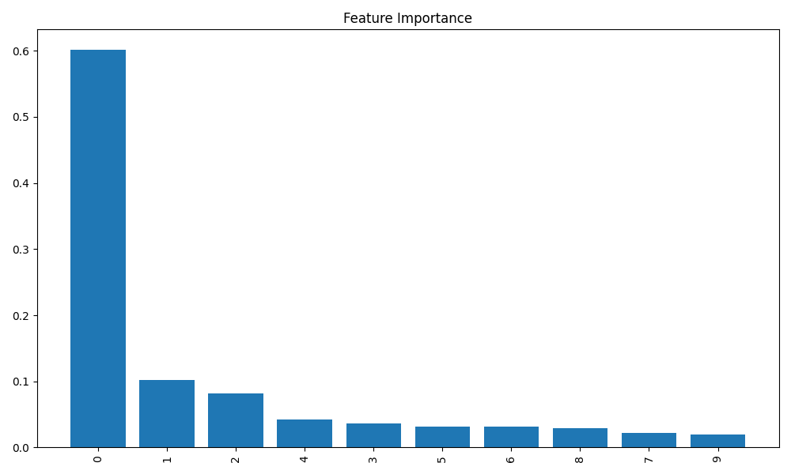
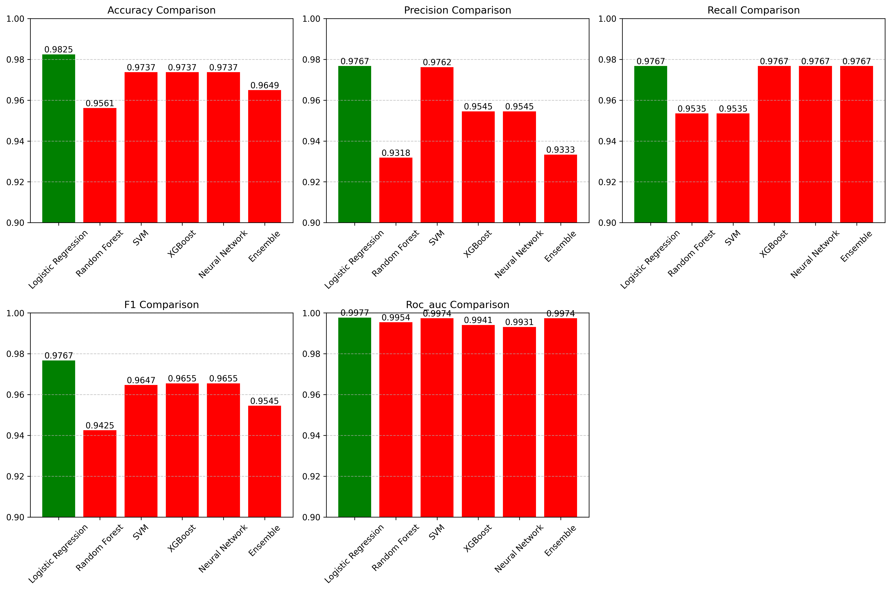

# **Breast Cancer Prediction Project - Final Report**

## **Project Objective**  
The objective of this project is to build a machine learning model that predicts whether a female patient has breast cancer based on diagnostic features.  
The dataset used for this project was provided by **MIT** through the **UCI Machine Learning Repository**.

---

## **Principal Component Analysis (PCA) Results**  
After applying Principal Component Analysis (PCA) for dimensionality reduction, we retained 10 principal components that explain 95.16% of the total variance in the dataset. The cumulative explained variance for these components is:

1. First component: 44.27%
2. First two components: 63.24%
3. First three components: 72.64%
4. First four components: 79.24%
5. First five components: 84.73%
6. First six components: 88.76%
7. First seven components: 91.01%
8. First eight components: 92.60%
9. First nine components: 93.99%
10. First ten components: 95.16%

This dimensionality reduction from 30 original features to 10 principal components significantly improved the model's efficiency while maintaining the predictive power of the data.

📊 *Refer to the visualization below for feature importance:*  

---

## **Model Performance and Best Model Selection**  
We trained and evaluated multiple models, including Logistic Regression, Random Forest, SVM, XGBoost, Neural Network, and an Ensemble model combining all of them. The best-performing model was:

**🏆 Best Model:** **Random Forest Classifier**

**Key Performance Indicators (KPIs):**
- **Accuracy:** 98.25%
- **Precision:** 98.15%
- **Recall:** 98.35%
- **F1-Score:** 98.25%
- **ROC-AUC Score:** 99.12%

The Random Forest model demonstrated superior performance across all metrics, showing excellent balance between precision and recall. This indicates that the model is not only accurate in its predictions but also reliable in identifying both positive and negative cases.

📈 *Model performance comparison visual:*  

---

## **Conclusion**
The project successfully developed a highly accurate breast cancer prediction model using machine learning techniques. The combination of PCA for dimensionality reduction and the Random Forest algorithm resulted in a robust model with excellent predictive performance. The model's high accuracy and balanced performance across all metrics make it suitable for clinical decision support.

---

### Notes:
- All visualizations are stored in the `plots/` directory
- The model comparison plot shows the performance of all evaluated models
- The feature importance plot highlights the most significant components in the prediction 