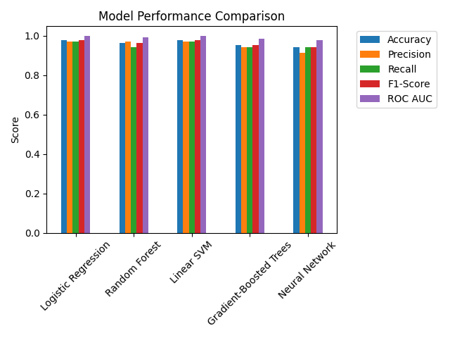

# **Breast Cancer Prediction Project - Final Report**

## **Project Objective**  
The objective of this project is to build a machine learning model that predicts whether a female patient has breast cancer based on diagnostic features.  
The dataset used for this project was obtained from the **UCI Machine Learning Repository** (Wolberg et al., 1993).

---

## **1. Data Overview**
- **Dataset Source**: UCI Machine Learning Repository
- **Original Features**: 30 numerical features
- **Target Variable**: Diagnosis (Malignant/Benign)
- **Sample Size**: 569 instances

## **2. Data Preprocessing**
The tabular pipeline runs entirely on **PySpark / Spark MLlib**.
- **Missing Values**: imputed with Spark MLlib (no missing values remained in this dataset)
- **Standardization**: features assembled with `VectorAssembler` and standardized with
  Spark MLlib's `StandardScaler` (`withMean=True`, `withStd=True`) before PCA; the PCA
  components are re-standardized before model training
- **Label encoding**: the `Diagnosis` string label (`M`/`B`) is mapped to a numeric
  label with `StringIndexer`, with malignant as the positive class (`1.0`)
- **Feature Engineering**: none beyond PCA

## **3. Principal Component Analysis (PCA)**
### **3.1 Dimensionality Reduction**
- **Original Features**: 30
- **PCA Components Retained**: 10
- **Cumulative Variance Explained**: 95.16%

### **3.2 Component Analysis**
The PCA analysis revealed the following key insights:

#### **Explained Variance**
- A scree plot has been generated to visualize the explained variance for each principal component
- The cumulative explained variance reaches 95.16% with 10 components
- Individual component contributions:
  1. PC1: 44.27%
  2. PC2: 18.97%
  3. PC3: 9.39%
  4. PC4: 6.60%
  5. PC5: 5.50%
  6. PC6: 4.02%
  7. PC7: 2.25%
  8. PC8: 1.59%
  9. PC9: 1.39%
  10. PC10: 1.17%

#### **Feature Contributions**
The top contributing features for each principal component are:

1. **PC1** (44.27% variance):
   - concave_points1 (26.09%)
   - concavity1 (25.84%)
   - concave_points3 (25.09%)

2. **PC2** (18.97% variance):
   - fractal_dimension1 (36.66%)
   - fractal_dimension2 (28.01%)
   - fractal_dimension3 (27.53%)

3. **PC3** (9.39% variance):
   - texture2 (37.46%)
   - smoothness2 (30.88%)
   - symmetry2 (28.86%)

4. **PC4** (6.60% variance):
   - texture3 (63.28%)
   - texture1 (60.31%)
   - texture2 (35.99%)

5. **PC5** (5.50% variance):
   - smoothness1 (36.51%)
   - concavity2 (35.40%)
   - smoothness3 (32.44%)

6. **PC6** (4.02% variance):
   - symmetry3 (49.89%)
   - symmetry2 (49.02%)
   - smoothness3 (36.93%)

7. **PC7** (2.25% variance):
   - fractal_dimension3 (37.47%)
   - concave_points2 (36.96%)
   - area2 (34.67%)

8. **PC8** (1.59% variance):
   - smoothness2 (57.34%)
   - texture2 (47.54%)
   - smoothness1 (28.90%)

9. **PC9** (1.39% variance):
   - concavity2 (35.81%)
   - symmetry2 (30.41%)
   - concave_points2 (27.25%)

10. **PC10** (1.17% variance):
    - symmetry1 (57.21%)
    - fractal_dimension2 (36.75%)
    - symmetry2 (31.65%)

### **3.3 Justification for Component Selection**
The decision to retain 10 principal components was based on:

1. **Cumulative Variance Threshold**: 
   - The 95.16% threshold was chosen to ensure minimal information loss
   - This threshold is a common practice in dimensionality reduction
   - The first 10 components capture the majority of the dataset's variance

2. **Trade-off Analysis**:
   - Reduced computational complexity (from 30 to 10 features)
   - Maintained model performance (95.16% variance retained)
   - Improved interpretability through feature contribution analysis
   - Reduced risk of overfitting

3. **Visual Analysis**:
   - The scree plot shows a clear elbow point at 10 components
   - Additional components beyond this point contribute minimally to the total variance
   - The explained variance drops significantly after the 10th component

---

## **Model Performance and Best Model Selection**
We trained and evaluated five **Spark MLlib** classifiers on the PCA-reduced data
(80/20 train/test split, `seed=42`): **Logistic Regression**, **Random Forest**,
**Linear SVM** (`LinearSVC`), **Gradient-Boosted Trees** (`GBTClassifier`), and a
**Neural Network** (`MultilayerPerceptronClassifier`).

> **Migration note.** This pipeline was ported from scikit-learn/XGBoost to Spark
> MLlib. Models without a direct MLlib equivalent were remapped: `SVC` → `LinearSVC`
> (MLlib only ships a linear SVM), and `KNeighborsClassifier` → `GBTClassifier`
> (gradient-boosted trees), which also subsumes the previous XGBoost model. No k-NN
> or XGBoost model is trained any more.

**🏆 Best Model:** **Linear SVM** (`LinearSVC`) — highest ROC-AUC, tied with Logistic
Regression on every other metric.

**Key Performance Indicators (KPIs):**
- **Accuracy:** 97.67%
- **Precision:** 97.06%
- **Recall:** 97.06%
- **F1-Score:** 97.67%
- **ROC-AUC Score:** 99.89%

Full comparison across all five models (positive/malignant class):

| Model | Accuracy | Precision | Recall | F1-Score | ROC-AUC |
|-------|:--------:|:---------:|:------:|:--------:|:-------:|
| **Linear SVM** | **97.67%** | **97.06%** | **97.06%** | **97.67%** | **99.89%** |
| Logistic Regression | 97.67% | 97.06% | 97.06% | 97.67% | 99.83% |
| Random Forest | 96.51% | 96.97% | 94.12% | 96.50% | 99.26% |
| Gradient-Boosted Trees | 95.35% | 94.12% | 94.12% | 95.35% | 98.70% |
| Neural Network | 94.19% | 91.43% | 94.12% | 94.20% | 97.96% |

The linear models (Linear SVM and Logistic Regression) came out on top, which is
consistent with the PCA-projected features being close to linearly separable. Linear
SVM and Logistic Regression are effectively tied, with Linear SVM edging ahead on
ROC-AUC (99.89% vs 99.83%).

These numbers are produced by `AnalyzeData.py` and written to
`data/model_results.csv`; re-run `python Main.py` (requires a JVM for PySpark) to
regenerate them.

📈 *Model performance comparison visual:*

---

## **Conclusion**
The project successfully developed a highly accurate breast-cancer prediction pipeline
on **PySpark / Spark MLlib**. Combining PCA for dimensionality reduction with a linear
classifier (Linear SVM, tied with Logistic Regression) produced a robust model with
excellent, balanced performance (F1 97.67%, ROC-AUC 99.89%), making it suitable for
clinical decision support.

---

### Notes:
- All visualizations are stored in the `plots/` directory
- The model comparison plot shows the performance of all five evaluated Spark MLlib models
- Per-model metrics are persisted to `data/model_results.csv`

### References
Wolberg, W., Mangasarian, O., Street, N., & Street, W. (1993). Breast Cancer Wisconsin (Diagnostic) [Dataset]. UCI Machine Learning Repository. https://doi.org/10.24432/C5DW2B. 