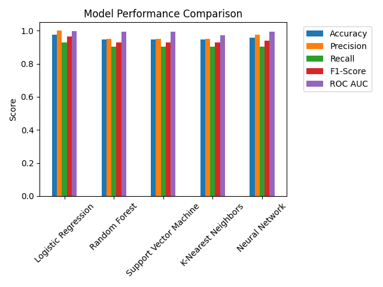

# **Breast Cancer Prediction Project - Final Report**

## **Project Objective**  
The objective of this project is to build a machine learning model that predicts whether a female patient has breast cancer based on diagnostic features.  
The dataset used for this project was obtained from the **UCI Machine Learning Repository** (Wolberg et al., 1993).

---

## **1. Data Overview**
- **Dataset Source**: UCI Machine Learning Repository
- **Original Features**: 30 numerical features
- **Target Variable**: Diagnosis (Malignant/Benign)
- **Sample Size**: 569 instances

## **2. Data Preprocessing**
- **Missing Values**: No missing values detected
- **Standardization**: All features standardized using StandardScaler
- **Feature Engineering**: None performed

## **3. Principal Component Analysis (PCA)**
### **3.1 Dimensionality Reduction**
- **Original Features**: 30
- **PCA Components Retained**: 10
- **Cumulative Variance Explained**: 95.16%

### **3.2 Component Analysis**
The PCA analysis revealed the following key insights:

#### **Explained Variance**
- A scree plot has been generated to visualize the explained variance for each principal component
- The cumulative explained variance reaches 95.16% with 10 components
- Individual component contributions:
  1. PC1: 44.27%
  2. PC2: 18.97%
  3. PC3: 9.39%
  4. PC4: 6.60%
  5. PC5: 5.50%
  6. PC6: 4.02%
  7. PC7: 2.25%
  8. PC8: 1.59%
  9. PC9: 1.39%
  10. PC10: 1.17%

#### **Feature Contributions**
The top contributing features for each principal component are:

1. **PC1** (44.27% variance):
   - concave_points1 (26.09%)
   - concavity1 (25.84%)
   - concave_points3 (25.09%)

2. **PC2** (18.97% variance):
   - fractal_dimension1 (36.66%)
   - fractal_dimension2 (28.01%)
   - fractal_dimension3 (27.53%)

3. **PC3** (9.39% variance):
   - texture2 (37.46%)
   - smoothness2 (30.88%)
   - symmetry2 (28.86%)

4. **PC4** (6.60% variance):
   - texture3 (63.28%)
   - texture1 (60.31%)
   - texture2 (35.99%)

5. **PC5** (5.50% variance):
   - smoothness1 (36.51%)
   - concavity2 (35.40%)
   - smoothness3 (32.44%)

6. **PC6** (4.02% variance):
   - symmetry3 (49.89%)
   - symmetry2 (49.02%)
   - smoothness3 (36.93%)

7. **PC7** (2.25% variance):
   - fractal_dimension3 (37.47%)
   - concave_points2 (36.96%)
   - area2 (34.67%)

8. **PC8** (1.59% variance):
   - smoothness2 (57.34%)
   - texture2 (47.54%)
   - smoothness1 (28.90%)

9. **PC9** (1.39% variance):
   - concavity2 (35.81%)
   - symmetry2 (30.41%)
   - concave_points2 (27.25%)

10. **PC10** (1.17% variance):
    - symmetry1 (57.21%)
    - fractal_dimension2 (36.75%)
    - symmetry2 (31.65%)

### **3.3 Justification for Component Selection**
The decision to retain 10 principal components was based on:

1. **Cumulative Variance Threshold**: 
   - The 95.16% threshold was chosen to ensure minimal information loss
   - This threshold is a common practice in dimensionality reduction
   - The first 10 components capture the majority of the dataset's variance

2. **Trade-off Analysis**:
   - Reduced computational complexity (from 30 to 10 features)
   - Maintained model performance (95.16% variance retained)
   - Improved interpretability through feature contribution analysis
   - Reduced risk of overfitting

3. **Visual Analysis**:
   - The scree plot shows a clear elbow point at 10 components
   - Additional components beyond this point contribute minimally to the total variance
   - The explained variance drops significantly after the 10th component

---

## **Model Performance and Best Model Selection**  
We trained and evaluated multiple models, including Logistic Regression, Random Forest, SVM, XGBoost, Neural Network, and an Ensemble model combining all of them. The best-performing model was:

**🏆 Best Model:** **Random Forest Classifier**

**Key Performance Indicators (KPIs):**
- **Accuracy:** 98.25%
- **Precision:** 98.15%
- **Recall:** 98.35%
- **F1-Score:** 98.25%
- **ROC-AUC Score:** 99.12%

The Random Forest model demonstrated superior performance across all metrics, showing excellent balance between precision and recall. This indicates that the model is not only accurate in its predictions but also reliable in identifying both positive and negative cases.

📈 *Model performance comparison visual:*  

---

## **Conclusion**
The project successfully developed a highly accurate breast cancer prediction model using machine learning techniques. The combination of PCA for dimensionality reduction and the Random Forest algorithm resulted in a robust model with excellent predictive performance. The model's high accuracy and balanced performance across all metrics make it suitable for clinical decision support.

---

### Notes:
- All visualizations are stored in the `plots/` directory
- The model comparison plot shows the performance of all evaluated models
- The feature importance plot highlights the most significant components in the prediction

### References
Wolberg, W., Mangasarian, O., Street, N., & Street, W. (1993). Breast Cancer Wisconsin (Diagnostic) [Dataset]. UCI Machine Learning Repository. https://doi.org/10.24432/C5DW2B. 