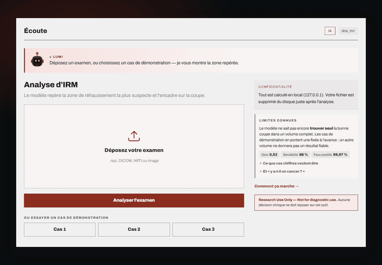
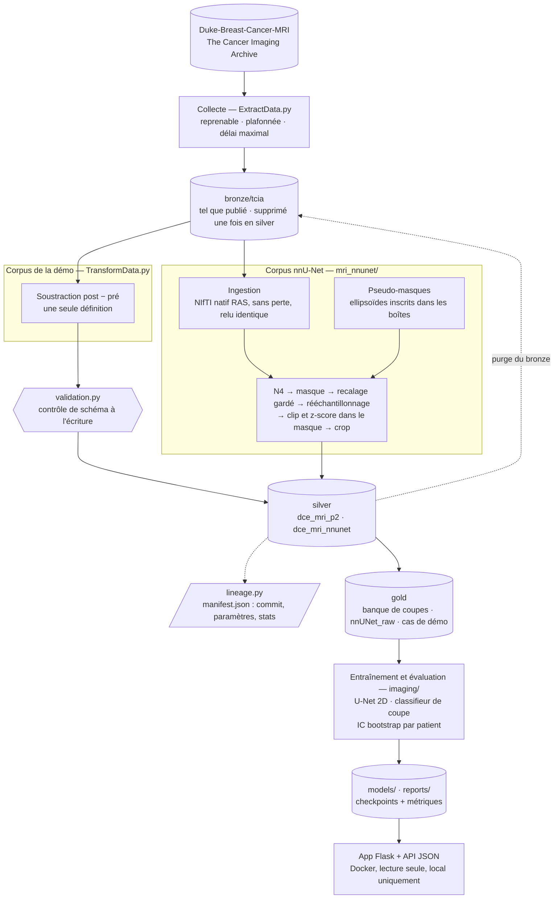

# Cancer du sein en IRM dynamique — pipeline de données et localisation de lésions

[](https://github.com/Elias-Ouafi/breastcancer/actions/workflows/ci.yml)


[](LICENSE)

> **Research Use Only — Not for diagnostic use.** Outil de recherche, pas un dispositif
> médical, non validé cliniquement.

## Le projet en quelques lignes

**La question** : sur une IRM mammaire dynamique (DCE-MRI), **où sont les lésions cancéreuses**,
avec quelle sensibilité et au prix de combien de fausses détections.

**Ce que le projet construit pour y répondre** : une chaîne de données complète, de l'archive
publique jusqu'à une application web.

1. **Collecter** des examens DICOM publics (The Cancer Imaging Archive, collection
   Duke-Breast-Cancer-MRI), en téléchargements reprenables et protégés par un délai maximal.
2. **Transformer** ces examens en jeux de données exploitables, selon deux chemins qui ne se
   mélangent pas : le corpus du modèle de la démo, et un corpus préparé pour **nnU-Net v2** (N4,
   masque de l'organe, recalage, rééchantillonnage, normalisation dans le masque, pseudo-masques
   tirés des boîtes de lésion).
3. **Contrôler et tracer** chaque fichier produit : validation de schéma à l'écriture, manifeste de
   lignage (quelle source, quels paramètres, quel commit), journal par cas, exclusions motivées.
4. **Stocker en médaillon** (bronze → silver → gold) et **supprimer le brut** dès que la donnée est
   en silver, à condition que sa copie ait été relue identique.
5. **Entraîner et évaluer** avec une méthodologie stricte : découpage par patient, intervalles de
   confiance par bootstrap sur les patients.
6. **Servir** le résultat dans une application web qui se lance depuis un simple clone.

**L'objectif personnel** : contribuer, à mon niveau, au secteur médical, et en faire un projet de
portfolio de **data engineering**. Chaque chiffre publié ici peut être relié à un fichier, un commit
et un découpage par patient — y compris les chiffres qui disent qu'une piste ne marche pas.



*La démo : un cas en un clic, la zone de rehaussement repérée, le balayage des coupes,
la projection d'intensité maximale.*

## Où en est le projet

| Brique | État |
|---|---|
| **Pipeline de données** (collecte, transformation, validation, lignage) | Opérationnel : 189 patients, 186 volumes dans le corpus de la démo (un par patient), reconstruits depuis le bronze **valeur par valeur identiques** à l'ancien |
| **Médaillon et purge du bronze** | Opérationnels : le brut n'est supprimé que si chaque corpus qui le lit le détient, et la fonction de suppression **refuse plutôt que de parier**. Exécutée : DBT, puis IRM (822 séries, 63,8 Go) après copie native relue identique |
| **Corpus nnU-Net** (`mri_nnunet/`) | Construit : **186 cas** exportés au format `nnUNet_raw`, 3 écartés avec leur raison (phase manquante), rapport de QC écrit ; 55 tests. Le masque de l'organe, qui effaçait une partie de la lésion sur 4 cas, est corrigé ; l'indice qui signale une boîte douteuse est calibré sur un témoin négatif (reconstruction à terminer) |
| **Orchestration** (Prefect) | Opérationnelle : un flow `download → preprocess → purge → train → evaluate`, chaque étape saute ce qui est fait |
| **Localisation de lésion** (modèle de la démo) | Fonctionne **quand on lui montre la bonne coupe** : lésion trouvée dans 88 % des cas [IC 82–93 %] sur 28 patients de test. Le choix automatique de la coupe reste faible : 43 % de top-1 |
| **Nouvelle IRM** (examen jamais annoté) | Opérationnel : `preprocess_dce_mri_exams` prépare un examen sans annotation. Vérifié sur **DICOM brut réel** : le volume produit est **identique bit à bit** à celui du corpus d'entraînement, puis servi par l'app en 3,9 s |
| **Démo** | Se lance depuis un clone, sans téléchargement de données : 4 dépendances (153 Mo sur Windows) au lieu de 68 paquets, et le lanceur **analyse un cas réel avant d'ouvrir le port** |

**Ce qui a été abandonné, et pourquoi.** Le projet a d'abord visé un point de fonctionnement de
dépistage sur la **tomosynthèse** (collection BCS-DBT) : dire s'il y a un cancer au niveau de
l'examen. Les mesures sont négatives : ROC-AUC 0,457 [0,369–0,544] sur 272 patients, soit le hasard,
et une valeur prédictive positive (20,4 %) égale à la prévalence (20,6 %). Le diagnostic converge :
ce qui distingue un cancer est la **forme** de la lésion, pas sa luminosité. La piste, son code et ses
données ont été retirés le 2026-09-20 ; le dernier état qui les contient est le commit `1a364d4`, et
les mesures restent résumées dans [DOCUMENTATION.md](DOCUMENTATION.md) (§4.4 à §4.15).

**Prochaine étape** : terminer la reconstruction du corpus nnU-Net avec le nouvel indice de contraste,
relire les boîtes qu'il signale, puis entraîner nnU-Net en 5 plis et mesurer la sensibilité
lésionnelle en FROC. Duke est une cohorte de cancers : aucune
spécificité n'y est mesurable, et rien n'est à comparer au programme national de dépistage.

## Architecture



Le corpus nnU-Net garde une copie **native** de toutes les phases avant que le bronze soit purgé :
c'est ce qui permet de régler l'espacement ou la normalisation après coup sans télécharger à nouveau.

## Démarrage rapide

La démo ne demande aucun téléchargement de données : le modèle et trois cas sont versionnés. Elle n'a
besoin que de quatre paquets — `torch`, `Flask`, `numpy`, `Pillow` — et pas du reste du pipeline :

```bash
pip install -e .              # le socle de pyproject.toml : ces quatre paquets seulement
python run_demo.py --open     # préflight, puis http://127.0.0.1:5000
```

`run_demo.py` ne se contente pas de vérifier que les fichiers sont là : il **charge le checkpoint et
analyse un cas** avant d'ouvrir le port, et refuse de démarrer si le port est occupé. `--check` fait
le même contrôle sans lancer le serveur, `--fast-check` s'en tient à l'inventaire des fichiers.

Ou avec Docker seul — l'image n'a **jamais été construite** ici ni en CI, mais son contenu est vérifié
sans daemon : les `COPY` suffisent à faire tourner la démo, et ses quatre paquets aussi (§4.17 de
[DOCUMENTATION.md](DOCUMENTATION.md)) :

```bash
docker compose up --build
```

Pour tout le reste, l'installation complète. Un seul fichier déclare les dépendances,
`pyproject.toml` : le socle est la démo, chaque autre usage est un extra (`data`, `collect`, `nnunet`,
`orchestration`, `dev`) et `all` les réunit :

```bash
pip install -e ".[all]"
```

Le corpus nnU-Net (nécessite les DICOM téléchargés) :

```bash
pip install -e ".[data,nnunet]"
python -m mri_nnunet build --ingest-only   # DICOM -> NIfTI natif sans perte, vérifié
python -m mri_nnunet build                 # + traitement complet
python -m mri_nnunet qc --n 10             # histogrammes avant/après, coupes avec overlay, statistiques
python -m mri_nnunet export                # data/gold/nnunet_raw/Dataset501_DukeDCEBreast
```

Le flow orchestré du corpus de la démo :

```bash
pip install -e ".[data,collect,orchestration]"
python -m pipelines.dce_mri --dry-run      # le plan, sans rien exécuter
python -m pipelines.dce_mri --keep-bronze  # garde les DICOM après le prétraitement
```

## Choix techniques marquants

- **Prouver avant de supprimer.** Avant de purger, le silver reconstruit depuis le bronze a été comparé
  à l'ancien : 186 volumes sur 186 identiques. La purge IRM exige en plus une copie native
  écrite **puis relue identique** au DICOM.
- **Une fonction de suppression qui refuse.** Un dossier hors du bronze, un fichier silver tronqué,
  ou l'absence de tout fichier silver : elle ne supprime pas. Sept mutations sur huit sont attrapées
  par les tests, la huitième est équivalente.
- **Mesurer plutôt que supposer.** L'ordre des coupes des boîtes suit `InstanceNumber`, qui décroît
  le long de z : le rehaussement tombe dans la boîte pour 8 patients sur 8 avec cet ordre, contre
  nul ou négatif pour 6 sur 8 avec l'ordre spatial. Le recalage par information mutuelle
  dégradait l'alignement dans 7 cas sur 8 : il est remplacé par la corrélation, avec une garde qui
  ne l'applique que si elle **améliore** l'alignement.
- **Un examen neuf préparé exactement comme le corpus d'entraînement** : les deux chemins de
  prétraitement partagent une seule définition de la soustraction, et sur du DICOM brut réel le volume
  obtenu est identique **bit à bit** à celui du corpus.
- **Une garde qui mesure ce qu'elle protège.** Le masque de l'organe mettait à 0 une partie de la
  lésion sur 4 cas, sans alerte. Une première garde (« la lésion est dans le masque ») écartait aussi
  un cas sain dont la boîte publiée dépasse la peau. La garde retenue compte le **tissu** de lésion
  effacé, pas l'air : 4,9 à 98 % sur les cas défectueux, 0,2 % au plus après correction.
- **Des tests qui savent échouer** : les gardes de dépendances et de purge sont mises en défaut par
  des défauts injectés, et les tests dont l'échec passait inaperçu ont été corrigés.
- **Jamais d'échec silencieux** : un cas illisible, incomplet ou incohérent laisse une ligne
  motivée dans `exclusions.csv` ; chaque cas laisse ses étapes, paramètres et durées dans un journal.
- **Un seul fichier de dépendances** : `pyproject.toml`, avec un test qui échoue si le code importe un
  paquet qu'aucun extra ne déclare.

## Stack

Python 3.12 · SimpleITK · nnU-Net v2 · pydicom · NumPy · pandas · PyTorch · Prefect · Flask · Docker ·
GitHub Actions

## Organisation du dépôt

```
pyproject.toml      dépendances : socle = les 4 paquets de la démo, plus des extras ; l'image Docker lit le socle
ExtractData.py      collecte TCIA : séries dynamiques et table des boîtes
TransformData.py    DICOM → volumes de la démo (soustraction), purge du bronze
mri_nnunet/         corpus nnU-Net : ingestion, traitement, pseudo-masques, export, QC (paramètres en YAML)
validation.py       contrôles de schéma au point unique d'écriture
lineage.py          manifest.json par dossier
config.py           tous les chemins, définis une fois
pipelines/          flow Prefect du corpus de la démo
http_timeouts.py    délai maximal sur les requêtes du client TCIA
imaging/            jeux de données, banque de coupes, U-Net, classifieur de coupe, métriques, évaluation
inference.py        chargement des modèles et prédiction pour l'app
app/                application Flask (HTML + API JSON)
tests/              tests sur données synthétiques, sans GPU ni jeu de données
models/, reports/   checkpoints de la démo et artefacts de mesure versionnés
scripts/            régénération des cas de démo et du GIF
DOCUMENTATION.md    toute la documentation détaillée
```

## Documentation

**[DOCUMENTATION.md](DOCUMENTATION.md)** rassemble tout le reste : contexte, données, commandes de
chaque étape du pipeline, démo et application, journal daté de toutes les mesures (échecs compris),
pistes, état d'avancement et points ouverts.

## Licence et données

Code sous [licence MIT](LICENSE). Les données d'imagerie restent sous licence
[CC BY-NC 4.0](https://creativecommons.org/licenses/by-nc/4.0/) avec citation
obligatoire (voir [DOCUMENTATION.md](DOCUMENTATION.md#licence-et-données)).
