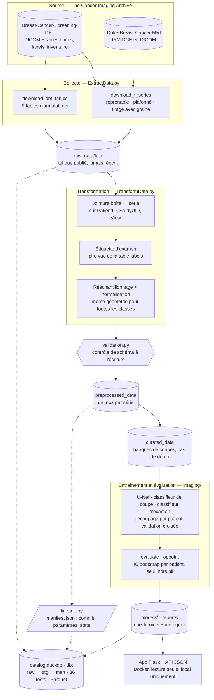

# Dépistage du cancer du sein — pipeline de données d'imagerie médicale

[](https://github.com/Elias-Ouafi/breastcancer/actions/workflows/ci.yml)


[](LICENSE)

> **Research Use Only — Not for diagnostic use.** Outil de recherche, pas un dispositif
> médical, non validé cliniquement.

## Le projet en quelques lignes

**La question** : à partir d'un examen de dépistage mammaire — une tomosynthèse (DBT,
mammographie 3D) ou une IRM —, dire **s'il y a un cancer**.

**Ce que le projet construit pour y répondre** : une chaîne de données complète, de
l'archive publique jusqu'à une application web.

1. **Collecter** 138 Go d'examens DICOM publics (The Cancer Imaging Archive) et leurs
   tables d'annotations, en téléchargements reprenables.
2. **Transformer** ces examens en jeux de données exploitables : volumes normalisés,
   masques de lésion, étiquettes fiables — rattachées par jointure, jamais devinées.
3. **Contrôler et tracer** chaque fichier produit : validation de schéma au moment de
   l'écriture, manifeste de lignage (quelle source, quels paramètres, quel commit).
4. **Cataloguer** l'ensemble dans une base DuckDB construite avec dbt, interrogeable en
   SQL et testée à chaque build.
5. **Entraîner et évaluer** des modèles avec une méthodologie stricte : découpage par
   patient, intervalles de confiance, seuil fixé hors échantillon.
6. **Servir** le résultat dans une application web qui se lance depuis un simple clone.

**L'objectif personnel** : contribuer, à mon niveau, au secteur médical, et en faire un
projet de portfolio de **data engineering**. Chaque chiffre publié ici peut être relié à
un fichier, un commit et un découpage par patient — y compris les chiffres qui disent
qu'un modèle ne marche pas.


*La démo : un cas en un clic, la zone de rehaussement repérée, le balayage des coupes,
la projection d'intensité maximale.*

## Où en est le projet

| Brique | État |
|---|---|
| **Pipeline de données** (collecte, transformation, validation, lignage, orchestration) | Opérationnel : 5 060 patients catalogués, deux corpus construits (260 séries annotées, 870 examens à deux classes), 0 avertissement de validation |
| **Catalogue de métadonnées** (DuckDB + dbt) | Opérationnel : 22 032 séries, 36 tests de qualité qui passent, reconstruit en ~10 s |
| **Localisation de lésion** (IRM, modèle de la démo) | Fonctionne **quand on lui montre la bonne coupe** : lésion trouvée dans 88 % des cas [IC 82–93 %] sur 28 patients de test |
| **Détection du cancer au niveau de l'examen** (DBT) | **Ne fonctionne pas, et c'est publié** : ROC-AUC 0,457 [0,369–0,544] sur 272 patients, soit le hasard |
| **Démo** | Se lance depuis un clone, sans téléchargement de données |

**Pourquoi la détection échoue.** Mesure après mesure (warm start, score relatif,
statistiques sans modèle jusqu'en résolution native), le diagnostic converge : ce qui
distingue un cancer est la **forme** de la lésion, pas sa luminosité, et une étiquette
« cancer / pas cancer » par examen ne suffit pas à l'apprendre sur 56 patients cancer.
Au seuil visé, la valeur prédictive positive (20,4 %) égale la prévalence (20,6 %) :
la réponse du modèle n'apporte aucune information. La piste suivante est un détecteur
supervisé par les boîtes de lésion, en résolution native.

**Priorité actuelle : le data engineering** — orchestration Prefect de la chaîne DBT,
stockage objet, robustesse des téléchargements.

## Architecture



Les flèches en pointillés alimentent le catalogue : tables d'annotations, disque,
manifestes et scores des modèles, joints et testés.

## Démarrage rapide

La démo ne demande aucun téléchargement de données : le modèle et trois cas sont
versionnés.

```bash
pip install -r requirements.txt
python run_demo.py            # puis ouvrir http://127.0.0.1:5000
```

Ou avec Docker seul :

```bash
docker compose up --build
```

Catalogue de métadonnées (nécessite les tables et les données téléchargées) :

```bash
pip install -e ".[catalog]"
python -m catalog build
python -m catalog query --file catalog/queries/01_data_funnel.sql
```

## Choix techniques marquants

- **Joindre plutôt que deviner.** Le tag DICOM de latéralité est faux sur 262 séries sur
  262 ; l'inventaire publié par la collection transforme l'appariement en jointure :
  260 séries, 0 masque vide.
- **Une seule source et une seule géométrie pour les deux classes**, sinon un modèle
  apprend le scanner ou la taille du tableau au lieu de la lésion.
- **Un seuil qui ne voit jamais les patients qu'il juge** : fixé à la sensibilité du
  programme national de dépistage (82,8 %), calé sur les autres plis.
- **Des tests qui savent échouer** : chaque contrôle de qualité clé du catalogue est mis
  en défaut sur des données où l'erreur est injectée.
- **Une migration vérifiée** : le passage du catalogue à dbt a été validé par comparaison
  ligne à ligne avec l'ancienne version.

## Stack

Python 3.12 · SQL · dbt · DuckDB · Parquet · pydicom · NumPy · pandas · PyTorch ·
Prefect · Flask · Docker · GitHub Actions

## Organisation du dépôt

```
ExtractData.py      collecte TCIA : tables d'annotations, séries annotées et normales
TransformData.py    DICOM → volumes normalisés + masques, jointure boîte/série, étiquettes
validation.py       contrôles de schéma au point unique d'écriture
lineage.py          manifest.json par dossier prétraité
config.py           tous les chemins, définis une fois
pipelines/          flow Prefect de la chaîne IRM
catalog/            catalogue de métadonnées : chargement, projet dbt, requêtes d'exemple
imaging/            jeux de données, banques, U-Net, classifieurs, métriques, évaluation
inference.py        chargement des modèles et prédiction pour l'app
app/                application Flask (HTML + API JSON)
tests/              tests sur données synthétiques, sans GPU ni jeu de données
models/, reports/   checkpoints et rapports versionnés
scripts/            régénération des cas de démo, du GIF et du graphe de lignage
DOCUMENTATION.md    toute la documentation détaillée
```

## Documentation

**[DOCUMENTATION.md](DOCUMENTATION.md)** rassemble tout le reste : contexte et
historique, cible chiffrée, données, commandes de chaque étape du pipeline, catalogue et
tests dbt, démo et application, décisions d'architecture, journal daté de toutes les
mesures (échecs compris), pistes, état d'avancement et points ouverts.

## Licence et données

Code sous [licence MIT](LICENSE). Les données d'imagerie restent sous licence
[CC BY-NC 4.0](https://creativecommons.org/licenses/by-nc/4.0/) avec citation
obligatoire (voir [DOCUMENTATION.md](DOCUMENTATION.md#licence-et-données)).
