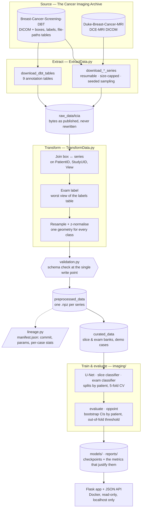

# Breast cancer screening — a medical imaging data pipeline

[](https://github.com/Elias-Ouafi/breastcancer/actions/workflows/ci.yml)


[](LICENSE)

> **Research Use Only — Not for diagnostic use.** Not a medical device, not clinically
> validated.

An end-to-end pipeline that turns **138 GB of public breast-imaging DICOM** (TCIA) into
validated, traceable, ML-ready datasets. Models are trained and scored on them, and the
result is served in a small web app that runs from a fresh clone in one command.

The question behind it: *given a screening exam (DBT or MRI), is there a cancer?* The
project is built so every figure it reports can be traced back to a file, a commit and
a patient-level split. That includes the figures that say a model does not work.


*The served demo: one-click case, flagged enhancing region, slice sweep, maximum-intensity
projection. The UI is in French. Rebuilt by
[scripts/make_demo_gif.py](scripts/make_demo_gif.py).*

## At a glance

| | |
|---|---|
| Raw data | 138 GB of DICOM from two TCIA collections (measured 2026-09-15) |
| Source catalogue read | 5,060 DBT screening patients, 9 annotation tables |
| Exam-level corpus built | 870 exams · 272 patients · 56 cancers, one geometry for both classes |
| Lesion corpus built | 260 annotated DBT series · 132 patients, 0 validation warnings |
| Demo model | DCE-MRI lesion localiser, 186 patients, evaluated on 28 held-out ones |
| Quality gates | 198 tests (no GPU, no dataset), ruff, GitHub Actions |
| Stack | Python 3.12 · pydicom · NumPy · pandas · PyTorch · Prefect · Flask · Docker |

## Architecture



The DCE-MRI branch runs as a single [Prefect](https://www.prefect.io) flow,
`download → preprocess → train → evaluate`
([pipelines/dce_mri.py](pipelines/dce_mri.py)). Each stage skips work already done, so
a run that crashes during training restarts at training instead of repeating the
download.

## Quick start

The demo needs no dataset: the checkpoint and three curated cases are versioned.

```bash
pip install -r requirements.txt
python run_demo.py            # then open http://127.0.0.1:5000
```

Or with Docker only:

```bash
docker compose up --build
```

Walkthrough, talking points and troubleshooting: [docs/demo.md](docs/demo.md)
(French: [DEMO.md](DEMO.md)).

## The pipeline, stage by stage

| Stage | Where | What it guarantees |
|---|---|---|
| **Extract** | [ExtractData.py](ExtractData.py) | Downloads resume where they stopped. The size cap counts only what the call adds. Normal exams are sampled with a fixed seed, not by ascending ID, because IDs follow site and date. |
| **Store** | [config.py](config.py) | Three layers: `raw_data` → `preprocessed_data` → `curated_data`. Every path is defined once, so moving a dataset is a one-line change. |
| **Transform** | [TransformData.py](TransformData.py) | Annotations are attached by a **join**, never inferred. Labels come from the only table that says "normal". Both classes go through the same geometry. |
| **Validate** | [validation.py](validation.py) | Shape, dtype, finiteness and mask binarity are checked where the file is written. A bad volume fails there, not three hours into training. |
| **Trace** | [lineage.py](lineage.py) | Each output folder gets a `manifest.json` with the git revision (`-dirty` if uncommitted), source, parameters and per-case stats. It is written last, so a missing manifest means the run was interrupted. |
| **Curate** | [imaging/exambank.py](imaging/exambank.py), [imaging/slicebank.py](imaging/slicebank.py) | Memory-mapped banks decompress ~870 exams once. The slice bank made each epoch 7.1× faster. |
| **Train / evaluate** | [imaging/](imaging/) | Patient-level splits and cross-validation. Confidence intervals are bootstrapped over patients, and the operating threshold comes from the other folds. |
| **Serve** | [app/](app/), [Dockerfile](Dockerfile) | Flask HTML + JSON API. The image has no JVM or ITK, runs read-only as non-root, and is published on loopback only. |

Commands for every stage: [docs/pipeline.md](docs/pipeline.md).

## Engineering decisions worth reading

Each one started as a measured failure. Every decision has a short record in
[docs/adr/](docs/adr/), and the full dated measurements are in
[docs/journal.md](docs/journal.md) (French).

- **Join, don't infer.** The DICOM laterality tag read `L` on all 262 downloaded
  series. Inferring the view from pixels was wrong 25 times out of 262. The
  collection's own `file-paths` table turns the match into a three-key join: 260
  series matched, 0 empty masks ([ADR 0004](docs/adr/0004-match-annotations-by-join.md)).
- **One geometry for both classes.** Cancer volumes cropped around the lesion
  (45×72×70) next to full-frame normals (2457×1890) can be separated by array shape
  alone. That gives an excellent AUC that measures the preprocessing, not the model.
  Every exam is therefore resampled to the same 384×384 frame, and the same flip rule
  applies to negatives ([ADR 0005](docs/adr/0005-one-source-one-geometry.md)).
- **Positives and negatives from the same source.** Cancers from one hospital's MRI
  and normals from elsewhere would teach the model the scanner. Both classes come
  from the same screening collection ([ADR 0005](docs/adr/0005-one-source-one-geometry.md)).
- **The threshold never sees the patients it judges.** The operating point is set at
  the national screening programme's target sensitivity (82.8 %), using the other
  four folds. The naive in-sample figure is published next to it and marked as not
  citable ([ADR 0006](docs/adr/0006-patient-level-evaluation.md)).
- **Versioned artefacts are tested.** A test fails if git does not *track* the demo
  checkpoint or cases. That failure would otherwise show up only on a fresh clone
  ([ADR 0008](docs/adr/0008-demo-reproducible-from-a-clone.md)).
- **Only transient failures retry.** A TCIA fetch that times out is retried. A
  crashed training run is not, since retrying would spend another hour hitting the
  same exception ([ADR 0003](docs/adr/0003-orchestrate-with-prefect.md)).

## Results — including what does not work

**Lesion localisation (DCE-MRI, served in the demo)**: 28 held-out patients, 95 % CI
bootstrapped over patients
([eval_report.json](models/dce_mri_p2_negfix/eval_report.json)).

| Metric | Value | 95 % CI |
|---|---:|---|
| Lesion found (IoU ≥ 0.1) | 88.0 % | 81.9 – 93.4 |
| Dice on lesion slices | 0.533 | 0.473 – 0.593 |
| False-positive regions per volume | 222 | 205 – 237 |
| Time per volume (RTX 5060 laptop) | 0.82 s | — |

The model outlines a lesion well **once shown the right slice**, but it cannot pick that
slice on its own, so the demo cases carry a slice chosen by a human. The app says so on
every screen. Dice is capped by the training masks, which are bounding boxes rather than
expert contours.

**Exam-level cancer detection (DBT)**: **negative, and published as such.** Patient
ROC-AUC is 0.457 [0.369 – 0.544] on 272 patients (56 cancers). Three variants trained
afterwards did no better, and neither did intensity statistics computed without any
model, even at native resolution. At the target sensitivity, the PPV (20.4 %) equals the
prevalence (20.6 %): a "cancer" answer carries no information
([operating point report](reports/examclf_operating_point.md)). The measurements point
to the kind of supervision rather than the amount of data. The next step is a detector
trained on the bounding boxes at native resolution, as in Buda et al. (2021).

## Repository layout

```
ExtractData.py      TCIA download: annotation tables, annotated and normal series
TransformData.py    DICOM → normalised volumes + masks, box/series join, exam labels
validation.py       schema checks at the single write point
lineage.py          manifest.json per preprocessed folder
config.py           every path, once
pipelines/          Prefect flow for the DCE-MRI branch
imaging/            datasets, banks, U-Net, classifiers, metrics, evaluation
inference.py        model loading and prediction for the app
app/                Flask app (HTML + JSON API)          → app/README.md
tests/              198 tests, synthetic DICOM fixtures, no GPU or dataset
models/, reports/   versioned checkpoints and metric reports
scripts/            demo case and demo GIF regeneration
docs/               pipeline reference, demo walkthrough, ADRs, journal
```

`data/` is gitignored and holds the three layers
(`raw_data/`, `preprocessed_data/`, `curated_data/`). Only the demo cases are versioned.

## Documentation

| Document | For |
|---|---|
| [docs/pipeline.md](docs/pipeline.md) | Commands and design notes for every stage |
| [docs/adr/](docs/adr/) | Architecture decision records: one decision, its context and its cost |
| [docs/demo.md](docs/demo.md) · [DEMO.md](DEMO.md) | Running and presenting the demo (English · French) |
| [app/README.md](app/README.md) | The web app: backends, endpoints, result contract |
| [docs/journal.md](docs/journal.md) | Dated decision and measurement log, failures included (French) |

## Development

```bash
pip install -e ".[dev]"
ruff check .
pytest              # 198 tests, no GPU or dataset needed
```

[CI](.github/workflows/ci.yml) runs both on every push and pull request. Logs go
through `logging` with timestamps and a copy under `logs/`; set
`BREASTCANCER_LOG_LEVEL=DEBUG` for more.

## License and data

The **code** is released under the [MIT License](LICENSE).

The **imaging data** is not covered by that license. Both TCIA collections are
distributed under [CC BY-NC 4.0](https://creativecommons.org/licenses/by-nc/4.0/)
and require citation. This covers the three demo cases in
`data/curated_data/demo_cases/` and the demo GIF, which are derived from
Duke-Breast-Cancer-MRI: they may be reused with attribution, for non-commercial
purposes only.

- Saha, A., Harowicz, M. R., Grimm, L. J., Weng, J., Cain, E. H., Kim, C. E., Ghate, S. V.,
  Walsh, R., & Mazurowski, M. A. (2021). *Dynamic contrast-enhanced magnetic resonance
  images of breast cancer patients with tumor locations* [Data set]. The Cancer Imaging
  Archive. <https://doi.org/10.7937/TCIA.e3sv-re93>
- Buda, M., Saha, A., Walsh, R., Ghate, S., Li, N., Swiecicki, A., Lo, J. Y., Yang, J., &
  Mazurowski, M. (2020). *Breast Cancer Screening – Digital Breast Tomosynthesis
  (BCS-DBT)* (Version 5) [Data set]. The Cancer Imaging Archive.
  <https://doi.org/10.7937/E4WT-CD02>

## Acknowledgments

- [The Cancer Imaging Archive](https://www.cancerimagingarchive.net/), for hosting both
  collections
- Buda et al., *A Data Set and Deep Learning Algorithm for the Detection of Masses and
  Architectural Distortions in Digital Breast Tomosynthesis Images*, JAMA Netw Open 2021,
  the reference detector for the DBT data
