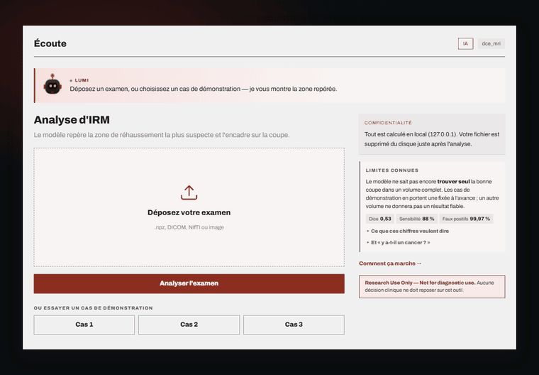
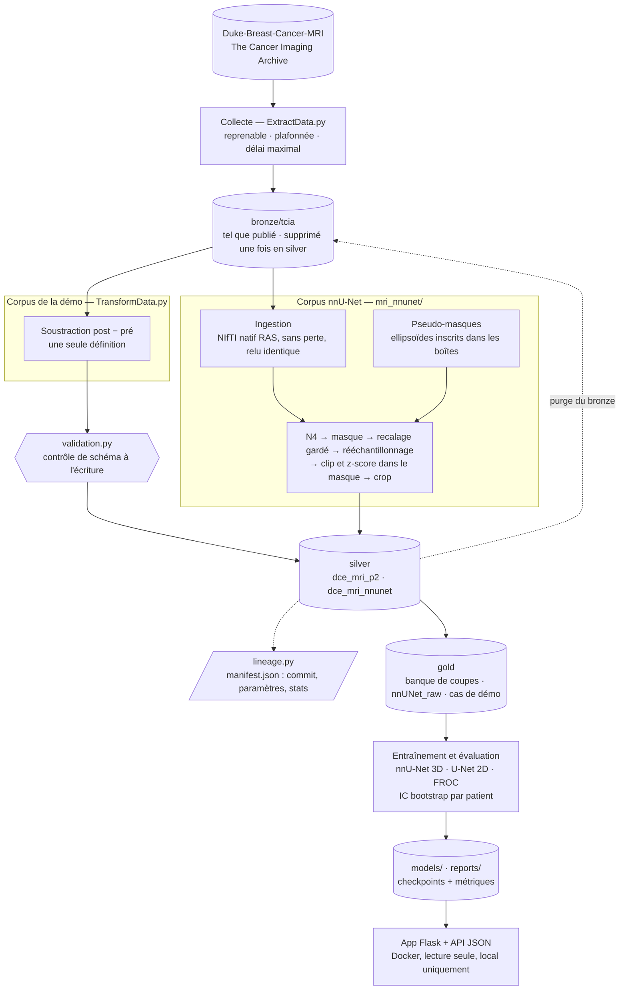

# Cancer du sein en IRM dynamique — trouver la lésion dans l'examen

[](https://github.com/Elias-Ouafi/breastcancer/actions/workflows/ci.yml)


[](LICENSE)

> **Research Use Only — Not for diagnostic use.** Outil de recherche, pas un dispositif
> médical, non validé cliniquement.

## L'essentiel

- **Un chiffre de détection qui tient debout** : 92,6 % des lésions trouvées [IC 81,5–100] à
  2 faux positifs par examen, sur 27 patients tenus à l'écart — avec le seuil de réussite écrit avant
  la mesure et le hasard mesuré à 0,33 %. Il lève le goulot diagnostiqué par le projet lui-même : le
  modèle 2D ne choisissait la bonne coupe que 43 % du temps, le passage en 3D supprime ce choix.
- **Une chaîne de données complète et prouvée** : de l'archive DICOM à l'application web — médaillon
  bronze → silver → gold avec purge du brut qui n'efface qu'après relecture identique (63,8 Go),
  validation à l'écriture, lignage, orchestration, CI, Docker, 273 tests. La reconstruction depuis le
  brut est identique valeur par valeur, et un examen neuf donne un volume identique **bit à bit** au
  corpus d'entraînement.
- **Une méthode qui attrape ses propres défauts** : la piste initiale a été abandonnée sur mesures
  négatives, publiées telles quelles (AUC 0,457, soit le hasard). Et à chaque étape, ce sont les gardes
  du projet qui ont révélé les erreurs — un masque qui effaçait la lésion, un manifeste annonçant
  249 anomalies pour 13 réelles, un garde-fou de test qui ne bloquait plus rien, un lecteur qui aurait
  mesuré le fond au lieu de la tumeur.

## Les résultats en clair

*Les trois points ci-dessus, sans vocabulaire de spécialiste.*

Une IRM mammaire n'est pas une image : c'est une pile de 150 à 200 coupes, comme les tranches d'un
pain. La tumeur n'apparaît que sur quelques-unes, et un radiologue les parcourt une à une. **Un
programme peut-il montrer directement la bonne zone ?**

**Sur 27 examens jamais vus, il a montré la bonne zone dans 25 cas (93 %)**, en signalant au passage
2 zones à tort par examen. Ces 27 examens étaient mis de côté **avant** l'entraînement : le programme
ne les avait jamais vus, ni pour apprendre, ni pour se régler. Et désigner un point au hasard dans
l'examen tombe sur la tumeur 3 fois sur 1 000, contre 930 pour le programme.

**Ce que le programme ne fait pas :**

- **Il ne dit pas s'il y a un cancer.** Toutes les patientes de la base en avaient un : il répond à
  « où est la lésion ? », jamais à « y en a-t-il une ? ». Ce n'est **pas du dépistage**.
- **Il ne dessine pas le contour de la tumeur.** La base ne fournit qu'un rectangle grossier : on
  vérifie qu'il pointe au bon endroit, pas qu'il en épouse la forme.
- **27 examens, c'est peu** : la marge d'erreur va de 82 % à 100 %. Le chiffre est solide dans sa
  direction, imprécis dans sa valeur. Les 2 fausses alarmes sont même **surestimées** — une seconde
  lésion non annotée, si le programme la trouve, lui est comptée comme une erreur.
- Il n'a **jamais été testé en conditions cliniques**.

La piste abandonnée citée plus haut visait « y a-t-il un cancer ? » sur mammographie 3D : le détail
des mesures est dans [DOCUMENTATION.md](DOCUMENTATION.md), §4.4 à §4.15.



## Démarrage rapide

Rien à télécharger : le modèle et trois examens réels sont versionnés, et la démo n'a besoin que de
quatre paquets (`torch`, `Flask`, `numpy`, `Pillow`).

```bash
pip install -e .
python run_demo.py --open     # préflight, puis http://127.0.0.1:5000
```

Le préflight **charge le modèle et analyse un vrai cas** avant d'ouvrir le port, et refuse de démarrer
si le port est occupé — `--check` fait le même contrôle sans servir, `--fast-check` s'arrête à
l'inventaire des fichiers. Alternative : `docker compose up --build` (image jamais construite ici ni
en CI, mais son contenu est vérifié sans daemon, §4.17).

Le reste du projet s'installe par extras (`data`, `collect`, `nnunet`, `orchestration`, `dev`), tous
déclarés dans le seul `pyproject.toml` :

```bash
pip install -e ".[all]"
python -m mri_nnunet build            # DICOM → corpus nnU-Net (puis qc, splits, export)
python -m pipelines.dce_mri --dry-run # le flow Prefect du corpus de la démo, sans rien exécuter
```

## Où en est le projet

| Brique | État |
|---|---|
| **Détection 3D** (nnU-Net, pli 0) | **92,6 % des lésions trouvées [IC 81,5–100] à 2 faux positifs par examen**, sur 27 patients tenus à l'écart ; le hasard vaut 0,33 % (§4.23) |
| **Découpage** | 27 patients dans `imagesTs`, hors de portée de nnU-Net qui ajuste son post-traitement sur la validation croisée ; 5 plis stratifiés par scanner, seule variable d'acquisition que Duke publie |
| **Corpus nnU-Net** (`mri_nnunet/`) | **186 cas** exportés, validés par `verify_dataset_integrity`, 3 écartés avec leur raison ; QC écrit, 5 boîtes douteuses signalées |
| **Pipeline de données** | 189 patients collectés, 186 volumes ; médaillon bronze → silver → gold, brut purgé une fois la copie relue identique (822 séries, 63,8 Go). Les corpus ont été supprimés après les mesures : le dépôt garde les preuves, pas les 32 Go |
| **Orchestration** (Prefect) | Flow `download → preprocess → purge → train → evaluate`, chaque étape saute ce qui est fait |
| **Modèle 2D de la démo** | 88 % [82–93] **quand on lui montre la bonne coupe**, 43 % de top-1 pour la choisir seul — c'est ce goulot que le modèle 3D supprime |
| **Nouvelle IRM** | Un examen jamais annoté est préparé et servi en 3,9 s ; sur DICOM brut réel, le volume obtenu est identique **bit à bit** au corpus d'entraînement |

**Prochaine étape** : entraîner les 4 plis restants pour resserrer l'intervalle, et relire les
5 boîtes signalées.

## Architecture


```mermaid
flowchart TB
    SRC[("Duke-Breast-Cancer-MRI<br/>The Cancer Imaging Archive")]
    EXTRACT["Collecte — ExtractData.py<br/>reprenable · plafonnée · délai maximal"]
    BRONZE[("bronze/tcia<br/>tel que publié · supprimé une fois en silver")]

    subgraph DEMO["Corpus de la démo — TransformData.py"]
        SUB["Soustraction post − pré<br/>une seule définition"]
    end

    subgraph NNUNET["Corpus nnU-Net — mri_nnunet/"]
        ING["Ingestion<br/>NIfTI natif RAS, sans perte, relu identique"]
        PROC["N4 → masque → recalage gardé → rééchantillonnage<br/>→ clip et z-score dans le masque → crop"]
        PSEUDO["Pseudo-masques<br/>ellipsoïdes inscrits dans les boîtes"]
    end

    VALID{{"validation.py<br/>contrôle de schéma à l'écriture"}}
    LINEAGE[/"lineage.py<br/>manifest.json : commit, paramètres, stats"/]
    SILVER[("silver<br/>dce_mri_p2 · dce_mri_nnunet")]
    GOLD[("gold<br/>banque de coupes · nnUNet_raw · cas de démo")]
    ML["Entraînement et évaluation<br/>nnU-Net 3D · U-Net 2D · FROC<br/>IC bootstrap par patient"]
    ART[("models/ · reports/<br/>checkpoints + métriques")]
    APP["App Flask + API JSON<br/>Docker, lecture seule, local uniquement"]

    SRC --> EXTRACT --> BRONZE
    BRONZE --> SUB --> VALID --> SILVER
    BRONZE --> ING --> PROC --> SILVER
    PSEUDO --> PROC
    SILVER -.->|"purge du bronze"| BRONZE
    SILVER -.-> LINEAGE
    SILVER --> GOLD --> ML --> ART --> APP
```

Python 3.12 · SimpleITK · nnU-Net v2 · pydicom · NumPy · pandas · PyTorch · Prefect · Flask · Docker ·
GitHub Actions

## Ce qui tient le projet

- **Mesurer plutôt que supposer.** L'ordre des coupes des boîtes, le recalage, le seuil qui signale une
  boîte douteuse : chacun a été tranché par une mesure contre un témoin, et deux l'ont été **contre**
  l'intuition de départ.
- **Des tests qui savent échouer.** Les gardes sont mises en défaut par des défauts injectés — sept
  mutations sur huit attrapées pour la purge du brut, la huitième étant équivalente.
- **Jamais d'échec silencieux** : un cas illisible ou incohérent laisse une ligne motivée dans
  `exclusions.csv`, et chaque cas ses étapes, paramètres et durées dans un journal.

## Organisation du dépôt

```
pyproject.toml      dépendances : socle = les 4 paquets de la démo, plus des extras
ExtractData.py      collecte TCIA : séries dynamiques et table des boîtes
TransformData.py    DICOM → volumes de la démo (soustraction), purge du bronze
mri_nnunet/         corpus nnU-Net : ingestion, traitement, pseudo-masques, découpage, export, QC
imaging/            jeux de données, U-Net 2D, classifieur de coupe, métriques, FROC
inference.py        chargement des modèles et prédiction pour l'app
app/                application Flask (HTML + API JSON)
validation.py       contrôles de schéma au point unique d'écriture
lineage.py          manifest.json par dossier
config.py           tous les chemins, définis une fois
pipelines/          flow Prefect du corpus de la démo
tests/              tests sur données synthétiques, sans GPU ni jeu de données
models/, reports/   checkpoints de la démo et artefacts de mesure versionnés
DOCUMENTATION.md    contexte, commandes, journal daté de toutes les mesures, points ouverts
```

## Licence et données

Code sous [licence MIT](LICENSE). Les données d'imagerie restent sous licence
[CC BY-NC 4.0](https://creativecommons.org/licenses/by-nc/4.0/) avec citation
obligatoire (voir [DOCUMENTATION.md](DOCUMENTATION.md#licence-et-données)).
