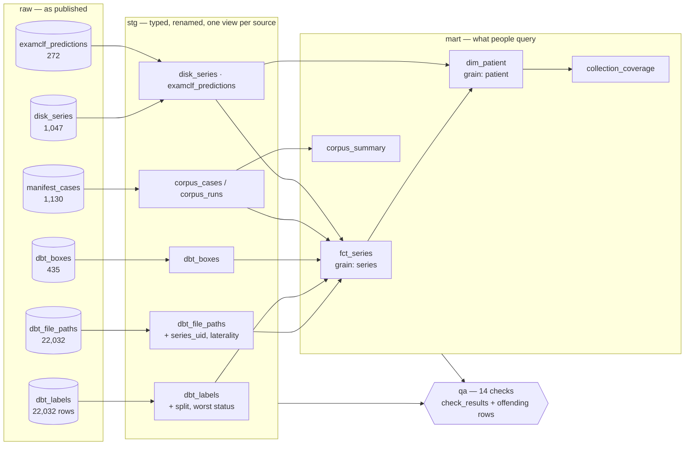

# Metadata catalogue

A single DuckDB file that puts together everything *about* the DBT data: the
collection's 9 annotation tables, which series are on disk, what each preprocessed
corpus holds, and how the exam classifier scored each patient. It is queried in SQL
and checked by 14 data-quality rules each time it is built.

```bash
pip install -e .                   # duckdb is a base dependency
python -m catalog build            # ~4 s on the full collection
python -m catalog checks --all
python -m catalog query "SELECT status, count(*) FROM mart.dim_patient GROUP BY ALL"
python -m catalog query --file catalog/queries/01_data_funnel.sql
```

The catalogue is written to `data/curated_data/catalog/catalog.duckdb` (8 MB), with each
mart table also exported to Parquet under `parquet/`. The folder is derived and
gitignored: deleting it loses nothing.

## Why it exists

Before the catalogue, "how many cancer patients of the validation split are downloaded,
and are they all in the exam corpus?" meant loading three CSVs, two manifests and a
directory listing into pandas and writing the join again. Each answer was a one-off
script, and the joins were never checked. Now it is a single query against tables whose
consistency is verified at every build. Why DuckDB and not another tool:
[ADR 0009](adr/0009-duckdb-metadata-catalogue.md).

## Layers



Row counts are from the build of 2026-09-16.

| Layer | Content | Built from |
|---|---|---|
| `raw` | Sources loaded untouched, plus the file each row came from | [catalog/build.py](../catalog/build.py) |
| `stg` | One view per source: trimmed keys, lower-case views, split taken from the file name, worst-flag status | [catalog/sql/staging/](../catalog/sql/staging/) |
| `mart` | Tables with a declared grain | [catalog/sql/marts/](../catalog/sql/marts/) |
| `qa` | One table of offending rows per check, plus `check_results` | [catalog/sql/checks/](../catalog/sql/checks/) |

There is one SQL model per file, run in file-name order, so the layers can move to dbt
without being rewritten.

## Mart tables

| Table | Grain | Key columns |
|---|---|---|
| `mart.fct_series` | one series of the collection (22,032) | `series_uid`, `patient_id`, `split`, `view_status`, `n_boxes`, `n_cancer_boxes`, `on_disk`, `disk_bytes`, `in_lesion_corpus`, `in_exam_corpus`, `exam_label`, `n_slices`, `mirrored` |
| `mart.dim_patient` | one patient (5,060) | `status` (worst over all views), `split`, `n_series`, `n_boxes`, `n_series_on_disk`, `fully_on_disk`, `disk_gb`, `n_series_in_exam_corpus`, `examclf_score`, `examclf_fold` |
| `mart.collection_coverage` | split × status | patients published, on disk, in the exam corpus, scored |
| `mart.corpus_summary` | preprocessed corpus | series, patients, positive patients, mean depth, mirrored, git revision of the run |

## Data-quality checks

Each check is a query that returns the rows violating it, so zero rows means a pass. A
check marked `error` guards a figure that would otherwise be wrong: a label, a key, a
split. A check marked `warn` flags something the pipeline already tolerates. If an
`error` check fails, `build` and `checks` exit with status 1, but the catalogue is still
written so the problem can be investigated (`SELECT * FROM qa.<check>`).

| Check | Severity | Guards against |
|---|---|---|
| `labels_key_unique` | error | a duplicated (patient, study, view) fanning out every join |
| `file_paths_series_unique` | error | the grain of `fct_series` breaking |
| `boxes_match_inventory` | error | a box that belongs to no series ([ADR 0004](adr/0004-match-annotations-by-join.md)) |
| `boxes_known_class` | error | a class other than benign / cancer |
| `patient_single_split` | error | one patient in two splits, i.e. train/test leakage |
| `corpus_cases_match_inventory` | error | a preprocessed volume attached to the wrong patient, study or view |
| `exam_corpus_label_matches_labels` | error | an exam label that disagrees with the labels table |
| `lesion_corpus_label_matches_boxes` | error | a lesion label that disagrees with the box class |
| `predictions_patients_in_exam_corpus` | error | a score for a patient the classifier never saw |
| `predictions_label_matches_corpus` | error | a scored label that differs from the corpus label |
| `labels_exactly_one_flag` | warn | a labels row with zero or several flags |
| `file_paths_have_labels` | warn | a series without a labels row (skipped by preprocessing) |
| `corpus_series_on_disk` | warn | a preprocessed case whose raw series has been deleted |
| `disk_series_in_inventory` | warn | a downloaded folder the inventory does not list |

**On the real data, all 14 pass.** Checks that always pass could simply be unable to
fail, so [tests/test_catalog.py](../tests/test_catalog.py) builds a miniature collection
and injects five defects: a wrong exam label, a wrong lesion label, a case attached to
the wrong patient, a score for a patient outside the corpus, and a wrong scored label.
For each one it asserts that the matching check fails. A deleted raw series must raise
only a warning.

## Example queries

Stored in [catalog/queries/](../catalog/queries/) and run by the test suite, so a
renamed column breaks a test rather than the documentation. Outputs below are from the
build of 2026-09-16.

**1. Data funnel**: published → downloaded → in the exam corpus → scored
(`01_data_funnel.sql`, abridged):

| split | status | patients | on disk | in exam corpus | scored | disk GB |
|---|---|---:|---:|---:|---:|---:|
| train | cancer | 39 | 39 | 39 | 39 | 6.3 |
| train | benign | 62 | 62 | 62 | 62 | 10.5 |
| train | normal | 4,083 | 135 | 135 | 135 | 44.7 |
| validation | cancer | 20 | **17** | 17 | 17 | 2.6 |
| validation | benign | 20 | **14** | 14 | 14 | 2.9 |
| validation | normal | 200 | 5 | 5 | 5 | 1.5 |
| test | cancer | 30 | 30 | **0** | 0 | 5.3 |
| test | benign | 30 | 30 | **0** | 0 | 4.5 |

The status totals over the collection reproduce the figures that were previously taken
from `TransformData.dbt_patient_status`: 4,581 normal, 278 actionable, 112 benign and 89
cancer patients.

**2. Annotated patients never downloaded** (`02_annotated_patients_not_downloaded.sql`):
9 patients, all in the validation split, **3 of them cancers** (DBT-P03621, DBT-P03628,
DBT-P04596). They are the unexplained gap between the 89 cancer patients the collection
publishes and the 86 on disk. They are also 3 cancers the exam classifier could have
trained on.

**3. Classifier score by true status** (`03_examclf_score_by_status.sql`):

| status | patients | mean score | median |
|---|---:|---:|---:|
| normal | 140 | 0.187 | 0.182 |
| cancer | 56 | 0.181 | 0.168 |
| benign | 76 | 0.180 | 0.161 |

Normal patients score *higher* on average than cancer patients. This is the published
AUC of 0.457 (journal §4.11), shown in a form anyone can recompute.

**4. Exam corpus balance by view and side** (`04_exam_corpus_balance.sql`): cancer
prevalence ranges from 9.9 % (left MLO) to 14.4 % (right MLO), and all 48 mirrored
series are left views. That is what the flip rule of
[ADR 0005](adr/0005-one-source-one-geometry.md) implies, and it is worth knowing before
using `mirrored` as a feature.

## Findings the catalogue surfaced

- **3 cancer patients were never downloaded** (query 2). Downloading them costs about
  0.5 GB: 6 series, at the ~85 MB average of the cancer series already on disk.
- **The test split's 60 annotated patients are on disk but in no corpus.** They were
  downloaded on 2026-09-14, after the exam corpus had been built (2026-09-13).
- **152 normal patients are on disk**, while the journal describes 150 downloaded
  normals. Not investigated yet.

## Limits

- DBT only. The DCE-MRI corpus predates `lineage.py` and has no manifest to load.
- Disk sizes come from `stat` and say a series is present, not that its DICOM is
  readable.
- Rebuilding is cheap (~4 s), so there is no incremental loading.
